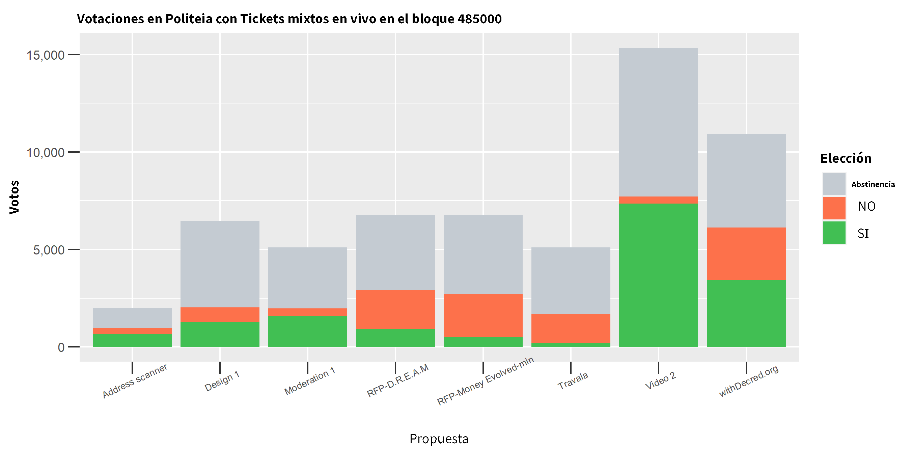
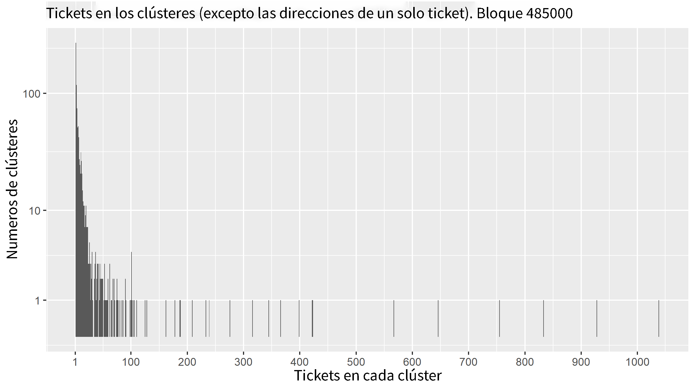
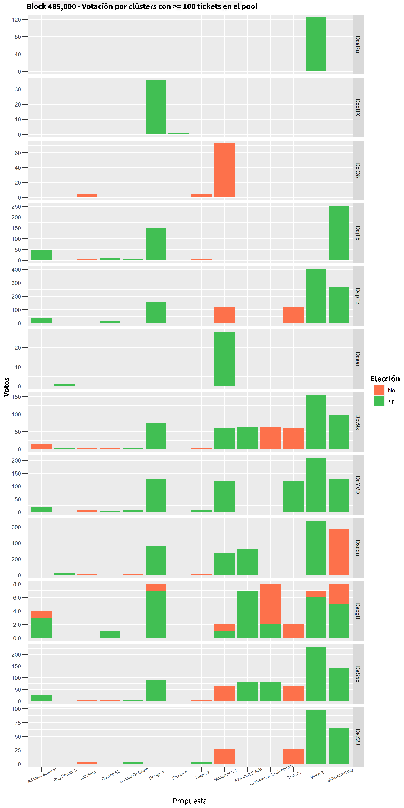
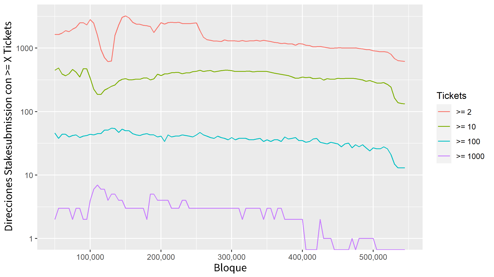

Análisis de la Blockchain de Decred - Parte 3
=============================================

### Historia de dos tickets pools

Este informe aplica las agrupaciones de direcciones de todos los tickets en los pools en determinadas alturas del bloque, el objetivo es explorar qué tipo de información se puede resumir sobre la composición de los pools de tickets, preguntas como cuántas entidades operan allí y cuánta actividad está siendo ofuscada por la mezcla. He seleccionado dos bloques y perfilaré los pools de tickets a la altura de cada bloque, además de ver como votan los clusters en staking.

El objetivo es construir una imagen de qué entidades estaban haciendo staking activamente con su DCR con técnicas de agrupación de direcciones disponibles y considerar si la imagen que muestran estas métricas indican algún cambio significativo en el período intermedio. Esto está destinado a ser parte de la construcción de una historia más completa de la blockchain de Decred que vendrá más adelante.

Las alturas de bloque que seleccioné son 485,000 (15 de septiembre del 2020) y 525,000 (1 de febrero del 2021). El período intermedio vio un aumento significativo en el precio de los tickets y un aumento en las tasas de participación en el voto de Politeia, es por eso que seleccioné estas alturas de bloque. Esperaba dar la vuelta al análisis con bastante rapidez, pero a lo largo del camino:

1) se destacó errores importantes en el nuevo código del cluster que escribí
2) me dio una forma de rastrear la fuente de esos errores. Escribí esta aventura en un propio [mini-informe](https://www.blockcommons.red/publication/clustering-deep-dive/), probablemente solo sea de interés para las personas que quieran comprender el cluster y el tipo de problemas que conlleva.

tl; dr aproximadamente el 1% de los tickets aún se están asignando a un clúster que no es real, se une a un operador de VSP y las direcciones de los usuarios de VSP. Todo lo demás parece muy sólido, al menos en la era de Politeia (más abajo).

### ¿Quién está en el pool?

Lo que nos interesa aquí es la *gente que compra* y vota con los tickets, pero lo más cerca que podemos llegar a eso es la entidad que controla un cluster de direcciones. Entonces, la primera pregunta que debe hacerse es ¿cuántas entidades diferentes hay en un pool de tickets?

En el bloque 485,000 contó con 22,239 entidades distintas; sin embargo la mayoría (21,262) de estas entidades solo están asociadas con un ticket cada una. Si bien algunas de estas entidades serán usuarios con un solo ticket, los usuarios que participan en la mezcla de Stake Shuffle también se ven así, pero estos pueden controlar muchos más tickets.

Hay una parte del pool de tickets que opera en claro y se puede rastrear y una parte que se mezcla solo se puede considerar en conjunto. Me resulta más fácil tratar estos conjuntos por separado, así que comencemos con el conjunto de tickets mixtos.

**Shuffled Stake** 

19,125 de los 485,000 tickets del bloque se compraron con insumos mixtos (47%) por lo que no hay mucho que decir sobre ellos, excepto sí votaron  y como lo hicieron.

**Bloque 485.000 Tickets Mixtos en Votaciones de Politeia**

Estos parecen estar ampliamente en línea con los resultados de la votación de la propuesta, por lo que parece que los tickets mixtos votaron de manera similar a los tickets sin mezclar.

Cada tickets tiene su propio ciclo de vida variable, desde que se compra hasta que se selecciona para votar al azar o se vence después de 142 días. Un ticket puede votar en cada propuesta de Politeia mientras el ticket este en vivo. Al tomar una snapshot del pool de tickets estos serán de diferente edad e historial de votaciones, por lo que he optado por excluir las propuestas para las cuales el conjunto de tickets tenía una elegibilidad muy baja (menos del 5% de los tickets elegibles en comparación con la propuesta para la que tenían el mayor número de tickets) - esto es principalmente para mantener los gráficos legibles. En los gráficos, las barras más altas significan principalmente que la propuesta fue sometida a votación cerca del bloque de snapshot, pero al mirar la barra de abstención puede ver qué proporción del pool de tickets mixtos (en esta snapshot) votó de qué manera en las propuestas antes y también después de ese tiempo.

Los tickets mixtos en esta snapshot del pool fueron elegibles para hacer 60,819 votos en las propuestas de Politeia; aprovecharon esta oportunidad en 27,266 ocasiones, para una tasa de participación del 45%.

### Las Ballenas del Stake

**Tickets por Clúster: Bloque 485,000**

Este histograma representa cada clúster que tenía al menos 2 tickets en el pool en el bloque 485.000 según la cantidad total de tickets que tenían en el pool.

Había 896 clústers distintos con más de 1 ticket cada uno, es probable que estos representen personas individuales o al menos billeteras individuales.

Las barras cortas (aunque las he alargado para hacerlas visibles) a la derecha representan cada una un clúster. Al juntarlos, había 33 usuarios que tenían cada uno 100 o más tickets y entre ellos tenían 11,255 tickets que es el 27% del pool.

Si consideramos la porción mixta (47%) y luego estos grupos con> = 100 tickets que cubren ~ 75% del pool en buen detalle.

**Block 485,000 - Votación por clústeres con >= 100 tickets en el pool**

Resulta que la mayoría de estos clústers no votan, solo hay votos de Politeia asociados con 12 de los 33 clústers principales en este período de tiempo de bloque.

Me parece interesante observar estas tramas de quién votó a favor / en contra de qué propuestas porque da una idea de las diferentes formas de pensar sobre el gasto de tesorería que motivan la votación de los stakeholders. Esto es algo que planeo seguir con el "clustering estadístico" o técnicas de análisis de clases latentes, ya que probablemente también representa una debilidad para la privacidad de mezcla de StakeShuffle para los stakeholders que votan en muchas propuestas de Politeia. Votar una gran cantidad de tickets sobre un gran número de propuestas produciría una huella que es fácil de seguir, incluso con pocos votos. Aunque algunos llegarán a tener "borrones" con votos contradictorios, estos podrían eliminar esto.

El gráfico anterior incluye el clúster Dsogb que como se discutió en el análisis profundo, es un artefacto de algún problema de agrupamiento. Después del trabajo de refinamiento y prueba del clúster (descrito en el análisis profundo) la escala del problema es una pequeña cantidad de tickets; observe la escala en el eje Y arriba, fue de alrededor de 8 votos por propuesta en el bloque 485,000 que parece que vino del clúster dudoso. Ninguno de los otros clústeres exhibe este tipo de patrón de votación contradictorio y consistente.

**Hasta luego a la reutilización de la dirección del stakesubmission**

En el otro extremo del espectro de privacidad de los usuarios de tickets mixtos se encuentran aquellos que reutilizan la misma dirección de stakesubmission para todas sus tickets. Este ha sido el comportamiento predeterminado para varios en el software de Decred en diferentes momentos y tengo entendido que el comportamiento ha tendido a cambiar a medida que se ha implementado la mezcla dentro de cada billetera.

El análisis de las direcciones stakesubmission y los clústeres deben producir resultados bastante similares, aunque la agrupaciones pueden conectar con varias direcciones de stakesubmission (reutilizadas) en un solo clúster. Sin embargo es mucho más fácil realizar un análisis de la reutilización de la dirección de stakesubmission directamente ya que este detalle se almacena junto con cada ticket.

**Las líneas representan el número de direcciones de stakesubmission** **que tenían al menos X tickets activos.**

Este gráfico de líneas muestra el efecto reciente de la versión v1.6 el 25 de enero (bloque ~ 523,000) en el que Decrediton no reutiliza la misma dirección de stakesubmission de la misma manera que lo hicieron sus versiones anteriores. La escala logarítmica del eje Y disminuye lo que es un efecto bastante sustancial particularmente entre los holders más grandes. El conjunto de direcciones de stakesubmission que controlaban más de 100 tickets activos numeró 27 en el bloque 500,000 pero cayó a 13 en el bloque 545,000.

Lo contrario son los tickets con una dirección de stakesubmission única. Estos aún se pueden vincular mirando las entradas a los tickets si no están mezclados, pero al menos dificultan el trabajo de cualquiera que desee identificar los tickets de un stakeholder; probablemente ya no sea posible hacerlo de manera eficiente con solo navegar enlaces en un explorador de bloques, se requeriría un enfoque computacional más riguroso para agrupar eficientemente los tickets.

imagen

**Entradas que no comparten una dirección de stakesubmission con otra entrada en el pool.**

### 139 Días de Votación en Decred

Saltando 40,000 bloques hacia adelante para bloquear 525,000 repitamos las mismas observaciones del ticket pool para ver qué ha cambiado y qué se ha mantenido igual.

Una pregunta rápida que podemos responder es si los clústers que vimos en el bloque 485,000 todavía están haciendo staking en el bloque 525,000.

Imagen

**Diagrama de dispersión que muestra la cantidad de tickets en vivo retenidos por un clúster en el bloque 485,000 y el bloque 525,000.**

Agregué una transformación +1 al recuento de tickets del bloque 525,000; de lo contrario los recuentos desde cero (donde el stakeholder abandonó) se habrían omitido del gráfico con ejes escalados logarítmicamente.

La línea azul en el gráfico es una línea de mejor ajuste, la línea roja es donde se encuentran los clústeres que tenían el mismo número de tickets en el bloque 485,000 y 525,000 y los puntos por encima de la línea roja redujeron su número de tickets entre el bloque 455,000 y 525,000.

Existe una fuerte correlación positiva (r = 0,92) entre el número de tickets retenidos en el bloque 485.000 y en el bloque 525.000. Esto sugiere que la población de stakeholders que no se mezclan se mantuvo bastante estable durante un considerable período de tiempo.

### Bloque topográfico 525.000 

En el bloque 525,000 conté con 26,933 entidades distintas; esto es aproximadamente ~ 4,000 más que el bloque 485,000 y nuevamente la mayoría (26,237) de estas entidades solo están asociadas con un ticket cada una. Hay 24,047 de tickets mixtos en el pool por lo que la proporción ha aumentado (al 58% desde el 47% del anterior).

imagen

**Gráfico de barras que muestra la distribución de tickets entre clústeres - Bloque 525.000**

imagen

**Bloque 525.000 de Tickets Mixtos en Votación para Politeia**

La tasa de participación para los tickets mixtos en este bloque resultó ser del 36% nuevamente por las votaciones, esto parece seguir un patrón similar a la votación de tickets sin mezclar.

Imagen

**Bloque 525,000 - Votación por clústeres con> = 100 tickets en el pool**

Hay menos clústeres ahora con 100 tickets, más de 22 clústeres que cumplen con los criterios y solo 10 de estos tenían votos Pi.

El gráfico que muestra la votación por conglomeración no incluye los tickets de abstinencia. Para este bloque la mayor parte de la votación de las propuestas es positiva pero esto se debe solo a que hubo más propuestas exitosas alrededor del bloque 525,000.

**Una mirada histórica hacia los clústeres.**

Ejecuté mi análisis de clústeres en todos los clústeres / direcciones que tenían más de 1 ticket en estos para ver qué pueden añadir los datos históricos a la interpretación de la actividad del pool de tickets.

Un buen punto de partida a considerar es si estas entidades son estables o dinámicas en su comportamiento: si el clúster tiene muchos tickets en el bloque 525.000 ¿significa que tendió a contener muchos tickets históricamente?

imagen

**Diagrama de dispersión con ejes logarítmicos, bloque 525.000 de Tickets retenidos frente a tickets históricos retenidos por clústeres**

La correlación entre los tickets en vivo y los tickets históricos es de 0,71 por lo que es bastante fuerte. La mayoría de los clústeres con muchos tickets en este bloque tendían a tener muchas tickets históricos.

También podemos ver cuánto tiempo han estado activos estos clústeres en términos de toda la actividad asociada con las direcciones que se han agrupado.

Imagen

**Diagrama de dispersión que muestra la edad de lo conglomerado (eje x) junto al número de posibles votos en Politeia (eje y) y la tasa de participación en las votaciones de Politeia (color)**

Este gráfico es bastante interesante porque sugiere que existe una relación entre cuándo se activaron los clústeres y la frecuencia con la que votan las propuestas de Politeia. Hubo un momento a principios del 2018 cuando muchos de estos clústeres se activaron por primera vez y la mayoría de estos que se originaron en ese momento tienen una participación muy baja en los votos en Politeia. Politeia no comenzó a recibir propuestas y votaciones hasta octubre del 2018 por lo que es poco probable que se deba a algo que estaba sucediendo con las propuestas específicamente.

Los grupos de stakeholders más activos recientemente muestran un porcentaje de participación de voto más alto. 2018 se destaca como un momento en el que se unieron grandes stakeholders que no votaron activamente con sus tickets hasta que se lanzó la plataforma Politeia.

### Categorizando a los votantes.

Si bien es bastante fácil compilar un registro del DCR y los movimientos de tickets asociados con clústeres no mezclados, es mucho más difícil distinguir entre diferentes "tipos" de usuarios que solo miran esta información. Una de las formas más fáciles de traer información adicional es ver de dónde proviene el DCR del usuario. El DCR que se extrajo por medio del Tesoro y que provino del bloque génesis (Airdrop y recompensa para los fundadores) es fácil de encontrar en la cadena, lo que significa que los clústeres que lo recibieron se pueden etiquetar. Para este análisis he combinado los datos de 1 o 2 saltos desde la fuente para brindar una vista simplificada de sí un clúster está asociado con una fuente particular de DCR. Algunos de los clústeres aparecen en algunos tipos diferentes, lo que complica la cuestión de cómo construirlos.

imagen

**Diagrama de dispersión para grupos con recompensas de airdrops entrantes que muestran la edad del clúster (eje x) junto al número de posibles votos en Politeia (eje y) y la tasa de participación en votaciones en Politeia (color)**

No es sorprendente ver que varios destinatarios de airdrops han estado activos desde 2016 y todavía se encontraban haciendo staking en el bloque 525,000 entre ellos algunos votantes grandes y altamente receptivos en Politeia. El gráfico también sugiere que varias personas "activaron" su airdrop a mediados del 2017 y se convirtieron en stakeholders (para bloquear 525,000) e incluso hay algunos airdrops que se activan a fines del 2018 para unirse al pool de tickets.

**Diagrama de dispersión para clústeres con recompensas del Tesoro entrantes que muestran la edad del clúster (eje x) el número de posibles votos en Politeia (eje y) y la tasa de participación en votaciones de Politeia (color)**

Parece que muchos de los contratistas que hacen stake con su DCR (para el bloque 525.000) tienen tasas de participación bastante altas en las votaciones de Politeia.

**Diagrama de dispersión para clústeres con recompensas de minería de PoW entrantes que muestran la edad del clúster (eje x) el número de posibles votos en Politeia (eje y) y la tasa de participación en las votaciones de Politeia (color).**

Esto sugiere que hay muchas stakeholders que han estado activos desde 2016 y extrajeron su DCR (probablemente antes) para así continuar haciendo staking y votando en las propuestas de Politeia. Este conjunto de primeros mineros se superpone con los otros conjuntos hasta cierto punto. Desde el comienzo del 2018 los mineros que apenas se habían activado e hicieron stake con DCR (dentro del mismo clúster de direcciones fácilmente asociado) rara vez votan en las propuestas en Politeia.

Esto es un solo vistazo inicial simplificando los datos de origen del DCR, la cantidad de una fuente conocida debe considerarse en relación con la cantidad total de DCR que llegó al clúster siendo una gran proporción de la cual puede ser de fuentes desconocidas. Específicamente, este análisis probablemente clasifica a muchos participantes como "mineros PoW" porque extrajeron un poco de DCR en algún momento, pero puede que eso no sea su método principal para adquirir el DCR.

Solo había un clúster con recompensas de fundador aún activas en el bloque 525,000, por lo que no voy a registrarlas ni a destacarlas.

### Algunos clústeres interesantes

Al observar los datos históricos de los conglomerados hay algunos que se destacan como inusuales. He visto muchos clústeres inusuales haciendo este trabajo y la mayoría de las veces resultaron ser artefactos haciedno un proceso de agrupamiento y daban señales de que algo andaba mal. Sin embargo, desde que realicé un gran esfuerzo para comprender los puntos débiles de los agrupamientos me siento más cómodo al interpretar estos grupos inusuales como probablemente un reflejo de los usuarios reales.

### **DsS5puNw**

Este se destaca por la gran cantidad de airdrops hop1 (92,730 DCR) lo que implica que alrededor de 329 airdrops (282 DCR cada uno) terminaron yendo a la misma billetera, lo que a su vez implica un abuso bastante fuerte del airdrop por parte de alguien. Para complicar aún más esta imagen, se encuentran 25,734 DCR que recibió directamente del Tesoro lo que sugiere que tal vez las mismas partes que abusaron del airdrop también pudieron obtener algunos pagos del Tesoro. La minería fue una fuente aún mayor para este clúster ya que 682,334 de DCR llegaron a las direcciones del clúster a 1 salto de las recompensas mineras.

imagenes

**Historial de saldos y votaciones para el clúster DsS5puNw**

Este grupo tuvo 86,411 tickets a lo largo de los años votando 72,848 veces. Un aspecto inusual del comportamiento de votación de este cluster es la votación del No sobre las propuestas de la agenda del 2017 (junto con los tickets que votaron a favor y se abstuvieron en la misma propuesta). El registro de votación de Politeia a continuación parece coherente y no troll, por lo que sospecho que este clúster sufre la fusión de los primeros usuarios de un VSP con el operador de ese VSP en un gran clúster. En este caso cuando comenzaron las propuestas de Politeia en octubre del 2018 parece que tal vez solo uno de los componentes del clúster todavía estaba activo, por lo cual no se vio nungún problema de alguna votación contradictoria.

imagen

**Historial de votaciones en Politeia para el clúster DsS5puNw**

Estoy interesado en cómo terminaron los 329 airdrops de DCR en este cluster, pero con algunos problemas de  probabilidad con la fusión de usuarios parece menos probable que ahora el mismo usuario haya obtenido pagos del Tesoro; es más probable que ambos usaran / operaran el misma stakepool.

Aislé los aciertos de direcciones de recompensa de airdrops para ver de dónde provenían estos fondos manualmente, clasificando por dirección; inmediatamente hay algunos ejemplos destacados de abuso de airdrop. Exploremos el primero Dsf9SCZdvQ8fEX91fyxjPYA4MkQuX9B63vR. Cada una de sus 26 entradas es una transacción por 282.56 desde una dirección de airdrop y el resto se divide en una dirección de cambio. En el salto 2 el patrón se vuelve más elaborado con transacciones con cantidades más grandes y aleatorias que llegan a direcciones como Dsi1xTMwqyRXdvDChg53fdSPKzhdZuP183s, pero continua tieniendo entradas en su mayoría e incluso provienen exclusivamente de muchas direcciones de airdrops diferentes.

Yo diría que la mayoría de los airdrops que fueron a las direcciones de este clúster se han jugado, pero no estoy seguro de si es una o varias entidades las que estaban copiando el airdrop; podrían borrarse juntas si posteriormente usaran la misma stakepool en un tiempo temprano en el que no se podía diferenciar de manera confiable a los usuarios / operadores del stakepool.

Los pagos de la tesorería que terminan en este clúster también merecen una mirada más de cerca, ya que pueden ser pistas sobre algún problema con el agrupamiento. Lo primero que hay que tener en cuenta es que las direcciones que reciben pagos del Tesoro directamente no pertenecen al clúster pero hay pagos bastantes regulares desde direcciones que reciben fondos del la tesorería a direcciones asociadas con este mismo. Estos pagos de tesorería se remontan a julio del 2016 hasta al menos del 2019 y han estado fluyendo a direcciones operadas por este clúster desde por lo menos febrero del 2017.

Es importante tener en cuenta que no estoy sugiriendo que un contratista de Decred haya robado a largo plazo desde el airdrop por 93,000 DCR. Es probable que los abusadores del airdrop y un contratista de Decred se hayan mezclado en el mismo clúster erróneamente pero solo una de las partes (el contratista, supongo) alguna vez votó con tickets en propuestas de Politeia. Es por eso que no estoy publicando ningún detalle de las direcciones o transacciones asociadas con el contratista en este clúster. Incluí direcciones para el abuso del airdrop porque me queda más claro que algo sospechoso está sucediendo allí. También vale la pena señalar que para el bloque 525,000 se redujeron a solo 214 tickets en vivo por lo que han reducido bastante su presencia: el saldo se ha reducido a 47,500 desde un máximo de 880,000 (puede ser posible que se la fusión de varios usuarios).

Seguí con la reagrupación desde la dirección Dsf9S que recibió más de 26 airdrops y este clúster no se conecta al registro de votación anterior; esa asociación debe introducirse desde un punto de partida diferente. Sin embargo esta ejecución de la agrupación mostró grandes éxitos para DCR en airdrops (85,883 en el salto 1) DCR minado (681,863 en el salto 1) y también algo de DCR priviniendo del Tesoro (23,951 en el salto 1). Solo hay 3 tickets asociados con este clúster, el enlace a todos esos otros tickets más el registro de votación anterior deben introducirse desde un punto de partida de dirección diferente y por lo tanto es más probable que sea erróneo.

Este sigue siendo uno de varios clústeres sobre los que tengo dudas y vigilo con cada refinamiento para ver si le encuentro más sentido.

### Dscqu

Este clúster también recogió algunos airdrops (14.131 DCR de airdrop en el salto 1) y ha recibido una pequeña cantidad del Tesoro de DCR (371) y también obtuvo por medio del PoW minado 565 DCR.

A diferencia del clúster anterior, los airdrops en cuestión esta vez se usaron para comprar tickets en lugar de combinarlos, por lo que no es fácil identificar los puntos de fusión en los que se puede demostrar que muchos de los fondos se combinaron. Sin embargo mi código de agrupación sugiere que una gran cantidad de DCR del airdrop terminaron en direcciones controladas por este clúster después de estar en stake.

imagenes

**Historial de saldos y votaciones para el clúster DscqujsH**

Desde el momento en que Politeia lanzó este clúster aparece como un stakeholder activamente comprometido con una alta tasa de votación para las propuestas de Politeia y en las votaciones consensuadas en cadena.

### DsSWT

Este clúster tiene muchas recompensas de minería hop 0 (520,000 DCR) y comenzó en marzo del 2018 por lo que parece ser por medio de un importante minero ASIC o alguien que comenzó a ejecutar un pool de minería en ese período de tiempo. Se comporta de manera similar a muchos de los puntos mineros en los diagramas de dispersión anteriores pero solo incursionó en el staking, compró 731 tickets pero no votó en absoluto sobre ninguno de los cambios de consenso o propuestas de Politeia (0 de 1,517 oportunidades).

imagenes

**Historial de saldos y votaciones para el clúster DsSWTHFr**

### Dcrh8

Una de los stakeholders más grandes en el bloque de 525.000 tickets sin mezclar en un pool también es un stakeholder desde hace mucho tiempo con 39.298 votos de tickets en bloques, ganando 37.000 DCR en recompensas. No hay coincidencias para las fuentes de su DCR y este clúster se activó en enero del 2018.

Imagenes

**Politeia con los votos del clúster Dcrh8**

El clúster solo votó sobre propuestas sobre el DEX, Market Makers y Ditto. Para la mayoría de los clústeres hay muy poco que los distinga, excepto su historial de votaciones. A veces el registro de votación indica la afiliación de un clúster (por ejemplo, sí las únicas propuestas de Politeia que alguna vez votaron apoyaban una propuesta específica de un creador de mercado) pero la mayoría de las veces solo nos puede brindar una idea de lo que los stakeholders valoran en términos de gastos del Tesoro.

imagenes

**Balance del clúster dcrh8 y registro de votaciones.**

El clúster parece haberse desvinculado de la votación de Politeia a fines del 2020 y luego de la votación por consenso, pero siguió comprando tickets hasta una reducción cerca del final del período de estudio.

Si le gustan las conspitaciones que conllevan las votaciones en Politeia por parte de los clústeres, podrá encontrar mucho más al final de la [inmersión profunda de agrupaciones](https://www.blockcommons.red/publication/clustering-deep-dive/).

### Siguientes pasos:

-   Observar más de cerca los primeros años de la historia de la blockchain de Decred para refinar aún más el enfoque para así abordar la agrupación en clústeres y comprender sus limitaciones.
-   Explorar otros usos de los datos a nivel clúster y encontrar una forma de explorar la asociación manual de clústeres porque es probable que estén relacionados.
-   Investigar las implicaciones de las votaciones frecuentes en Politeia para la privacidad de los stakeholders.
-   Estoy abierto a sugerencias sobre lo que sería interesante analizar a continuación con los datos de la cadena.
