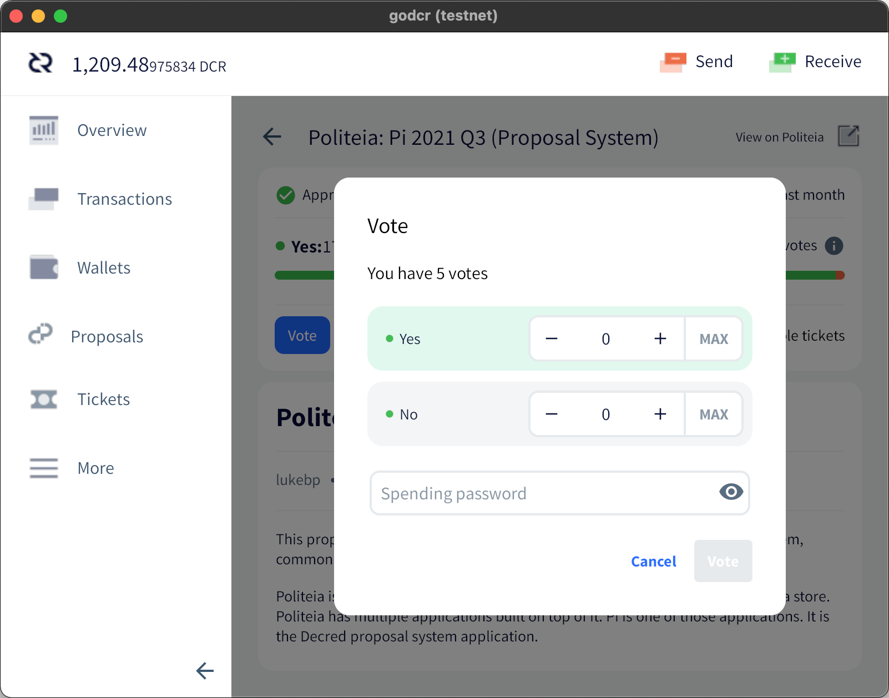
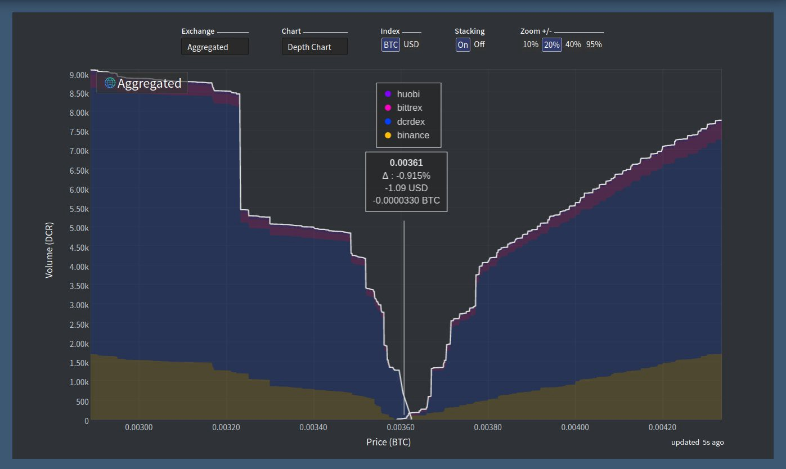

# Revista Decred Junio 2021

Core Lattice por @saender

Lo más destacado de junio:

- Se aprobó una próxima actualización de consenso en Politeia que haría que los cambios de consenso futuros sean más fáciles, más confiables y más seguros.
- Un error con los controles de los gastos de tesorería provocó la imposición de un límite demasiado bajo; esto requerirá una actualización por consenso para solucionarlo.
- Tres propuestas de Politeia aprobadas con una alta participación (~ 47%) y votos a favor (97–99%): Bug Bounty, Traducciones y la versión explícita de mejora en el cambio de consenso.
El hashrate de PoW ha experimentado una caída significativa, probablemente asociada con la represión de la minería en China.

Contenido

- [Nuevo bug en el fondo de tesorería]()
- [Desarrollo]()
- [Comunidad]()
- [Gobernanza]()
- [Red]()
- [Ecosistema]()
- [Alcance]()
- [Eventos]()
- [Media]()
- [Discusiones]()
- [Mercado]()
- [Relevantes externos]()
- [Sobre]()

## Nuevo bug en el fondo de tesorería

Los pagos del nuevo fondo de tesorería están bloqueados durante varios meses por un error en la implementación de la política de gastos. La transacción de gasto de tesorería de prueba extraída el [22 de mayo](https://explorer.dcrdata.org/tx/7507bcc72bfde895065034e12e6d462f2360163cd0c879f0db35514f9456b2c1) desencadenó una condición pasada por alto en el mecanismo de seguridad que protege de gastar demasiado DCR en un corto período de tiempo. Durante los próximos meses, solo se pueden gastar alrededor de 0.15 DCR de la nueva tesorería, que es demasiado bajo para pagar a los contratistas.

Si bien este es un retraso desafortunado en la migración a la tesorería descentralizada y trabajo adicional para corregir el error, el plan de migración se creó para manejar casos como este. Todos los fondos de la red están seguros y los pagos de los contratistas continuarán desde la tesorería anterior. Arreglar el algoritmo de seguridad requiere otro cambio de consenso que está [en desarrollo](https://github.com/decred/dcps/pull/20).

Leé la historia completa del error en la [publicación del blog](https://blog.decred.org/2021/06/25/Treasury-Expenditure-Policy-Bug/) y en los hilos de Twitter de [@matheusd](https://twitter.com/matheusd_tech/status/1409928455974699013) y [@lukebp](https://twitter.com/lukebp_/status/1409929016400822279).

> En una nota al margen, este incidente nos recuerda que incluso el código de consenso ampliamente [revisado](https://github.com/decred/dcrd/pull/2170) y probado no es inmune a los errores, pero son más fáciles de corregir cuando existe un proceso de actualización bien definido y no controvertido.

## Desarrollo

El trabajo que se informa a continuación tiene el estado "fusionado con el maestro", a menos que se indique lo contrario. Significa que el trabajo se completa, se revisa e integra en el código fuente que los usuarios avanzados pueden [crear y ejecutar](https://medium.com/@artikozel/the-decred-node-back-to-the-source-part-one-27d4576e7e1c), pero aún no está disponible en los binarios de la versión para los usuarios habituales.

### [dcrd](https://github.com/decred/dcrd)
La forma en que se manejan los scripts estándar se ha reescrito para abordar varios problemas de larga data.

Para una rápida introducción, los "scripts" son pequeños comandos almacenados dentro de las transacciones que consumen monedas como "input" de transacciones pasadas y crean nuevas monedas como "outputs" para el destinatario. Los "scripts estándar" son un subconjunto de todos los scripts permitidos por el consenso que cubren las operaciones más útiles (envío de fondos, staking, multisig, etc.) optimizados para la eficiencia y la seguridad de la red. Los nodos de la red principal normalmente se negarán a aceptar y retransmitir transacciones independientes (aquellas que no forman parte de un bloque) que contengan scripts no estándar.

El [código reescrito](https://github.com/decred/dcrd/pull/2656) agregó un nuevo paquete llamado `stdscript` que admite diferentes versiones de script (esto era difícil de admitir anteriormente y ahora es necesario para la próxima actualización de consenso), proporciona una API más ergonómica para los desarrolladores (incluidos los ayudantes de atomic swap y multisig) y mejora la separación entre "Estándar" y "consenso" (un punto común de confusión para los nuevos desarrolladores). Además, la política de qué scripts que se consideran "estándar" se ha reforzado aún más para ayudar a garantizar que los scripts típicos ocupen menos espacio en la cadena y restringir aún más los casos que no tienen sentido.

Como de costumbre, este gran cambio viene con en una serie de confirmaciones fáciles de digerir con descripciones informativas, pruebas, evaluaciones comparativas, ejemplos, todo terminado con un nuevo [README](https://github.com/decred/dcrd/blob/62950c2b8b8d831cacf6f2ec46216e420d2658cc/internal/staging/stdscript/README.md) completo.

Entre otros varios [cambios](https://github.com/decred/dcrd/pulls?q=standardness+is%3Apr+merged%3A2021-06-01..2021-06-30+sort%3Aupdated-asc) se han centrado en eliminar los usos del código de estandarización del código de consenso, ya que la política de lo que se considera "estándar" puede cambiar en cualquier momento sin requerir un cambio de consenso y, por lo tanto, el código de consenso no debe verse afectado.

Se ha presentado y aprobado una [propuesta](https://proposals.decred.org/record/3a98861) para desarrollar el próximo cambio de consenso. Esta actualización prácticamente prohibirá los soft forks para simplificar futuros cambios de consenso y [mejorar la seguridad](https://proposals.decred.org/record/3a98861/comments/8). Una vez activa, los nodos completos comenzarán a rechazar transacciones y scripts de versiones más nuevas que no se comprenden, en lugar de ignorarlos y creer que aún se pueden validar completamente en la cadena.

> Los soft forks son principalmente el resultado de sistemas menos capaces con deficiencias técnicas y la falta de procesos formales de gobernanza necesarios para implementarlos de manera incontrovertible ([@davecgh](https://proposals.decred.org/record/3a98861))

Es posible alejarse aún más de los soft forks gracias al proceso sin dramas de Decred de coordinar los hard forks y su comunidad altamente comprometida.

### [dcrwallet](https://github.com/decred/dcrwallet)

- opción para [desaprobar](https://github.com/decred/dcrwallet/pull/2054) bloques aleatoriamente (destinados a pruebas y no se puedan utilizar en la red principal)
- actualización a los últimos [módulos dcrd](https://github.com/decred/dcrwallet/pull/2056), incluido el nuevo `stdaddr`
- eliminación de los intentos de votación o revocación cuando la clave privada [no este disponible](https://github.com/decred/dcrwallet/pull/2062) (debería evitar algunos errores del comprador de tickets)
- uso de múltiples [conexiones](https://github.com/decred/dcrwallet/pull/1983) cuando se compre tickets automáticamente (puede resultar en una mezcla más lenta si la cuenta de financiamiento tiene UTXO limitadas)

### [Decrediton](https://github.com/decred/decrediton)

Orientado al usuario:

- atenúe la [pestaña DEX](https://github.com/decred/decrediton/pull/3505) y muestra información sobre las herramientas en lugar de ocultarla en el modo SPV (esto ha confundido a mucha gente)
- se agregaron opciones [avanzadas](https://github.com/decred/decrediton/pull/3487) para restaurar la billetera (deshabilite las actualizaciones de tipo de moneda y establezca el límite de brecha)
- se permite [frases de contraseña](https://github.com/decred/decrediton/pull/3470) vacías para admitir la función de [frase contraseña](https://wiki.trezor.io/Passphrase) en Trezor
- se permite ingresar una frase contraseña en el propio [Trezor](https://github.com/decred/decrediton/pull/3496) en lugar de preguntarla en Decrediton (solo modelo T)
- implementación de un nuevo diseño de interfaz de usuario para las vistas de [gobernanza](https://github.com/decred/decrediton/pull/3467) (tanto en propuestas como en cambios de consenso)
- componente de [entrada de texto](https://github.com/decred/decrediton/pull/3398) integrado de la biblioteca [pi-ui](https://github.com/decred/pi-ui). Para respaldar la especificación de diseño de Decrediton, se [actualizó](https://github.com/decred/pi-ui/pull/326) con nuevas características que otros proyectos basados en React en donde ahora se puedan usar.
- ~ 10 correcciones de errores

Los cambios orientados a los desarrolladores incluyen la finalización de varias mejoras de seguridad que tardaron en realizarse:

- pruebas automatizadas para las vistas de [envío](https://github.com/decred/decrediton/pull/3489), [recepción](https://github.com/decred/decrediton/pull/3490) y [exportación](https://github.com/decred/decrediton/pull/3493)
- [configuración de Webpack](https://github.com/decred/decrediton/pull/3503) reorganizada, limpia y optimizada
- inhabilitación de la [integración de Node](https://github.com/decred/decrediton/pull/3486) en el código de la interfaz de usuario para que ya no se pueda acceder directamente a las API de Electron y Node de bajo nivel. Esta es una característica de seguridad importante y una práctica [recomendada](https://www.electronjs.org/docs/tutorial/security#2-do-not-enable-nodejs-integration-for-remote-content) en el desarrollo de aplicaciones modernas de Electron
- aislamiento de [contexto](https://github.com/decred/decrediton/pull/3492) habilitado en la ventana principal: otra característica de [seguridad](https://www.electronjs.org/docs/tutorial/security#3-enable-context-isolation-for-remote-content) importante que restringe aún más el código de la interfaz de usuario
- habilitación de la función [`webSecurity`](https://github.com/decred/decrediton/pull/3500) para reforzar las solicitudes externas (esto también corrigió el modo de desarrollo en Windows)
- [dependencias](https://github.com/decred/decrediton/pull/3509) reducidas para depender menos del código de terceros y mejorar la seguridad al reducir la superficie de un posible ataque a la cadena de suministro
- se introdujo un cuadro de diálogo de confirmación más seguro y se usó para confirmar el [acceso a VSP](https://github.com/decred/decrediton/pull/3515) junto a la [firma de transacciones](https://github.com/decred/decrediton/pull/3519).

### [Politeia](https://github.com/decred/politeia)
Orientado al usuario:

- se agregó un botón para acceder al [raw Markdown](https://github.com/decred/politeiagui/issues/2415) 
- se puede mostrar el estado del pago del [crédito de la propuesta](https://github.com/decred/politeiagui/pull/2417) (da una idea de qué tan pronto se pueden usar los créditos para enviar nuevas propuestas)
- se puede [mostrar un banner](https://github.com/decred/politeiagui/pull/2456) cuando el usuario esté viendo `proposals-archive.decred.org` para reducir la confusión al hacer clic en el logotipo del sitio
- aspecto mejorado del botón de [flat mode](https://github.com/decred/politeiagui/pull/2434)
- se agregó el nombre de la propuesta a los [asuntos](https://github.com/decred/politeia/pull/1440) del correo electrónico
- ~ 13 correcciones de errores

Backend y CLI:

- `politeiavoter` [actualizado](https://github.com/decred/politeia/pull/1235) a la nueva API lanzada en [v1.0.0](https://github.com/decred/politeia/releases/tag/v1.0.0)
- `politeiavoter` ahora volverá a [intentar](https://github.com/decred/politeia/pull/1438) sus votos en los errores del servidor
- se agregó la implementación de [MySQL](https://github.com/decred/politeia/pull/1419) en la base de datos de usuarios. Será necesario migrar los datos de CockroachDB para eliminar esta dependencia y tener solo una base de datos con la que lidiar. La elección de MySQL fue dictada por [tlog](https://github.com/decred/politeia/issues/1392) (que [no es compatible](https://github.com/google/trillian/issues/1298) con PostgreSQL).
- [READMEs](https://github.com/decred/politeia/pull/1421) actualizados con instrucciones de configuración para obtener una instancia completa de Politeia en funcionamiento (nuevos colaboradores, ¡no esperen más!)
- Se agregaron [docs](https://github.com/decred/politeia/pull/1435) faltantes de las herramientas `pictl`y `politeiaverify`
- seguimientos de [pila más significativos](https://github.com/decred/politeia/pull/1428)
- cobertura de prueba para la gestión de [usuarios](https://github.com/decred/politeia/pull/1235) y peticiones
- ~ 2 correcciones de errores.

Sistema de gestión de contratistas (CMS):
- se permite el uso de [propuestas archivadas](https://github.com/decred/politeia/pull/1422) en facturas
- seguimiento agregado de los [gastos](https://github.com/decred/politeia/pull/1431) de la nueva tesorería (para determinar si se ha pagado la factura)
- cálculo de [gastos](https://github.com/decred/politeia/pull/1429) de propuesta fija y petición de la versión correcta de la factura.

@lukebp compartió una buena [introducción educativa](https://twitter.com/lukebp_/status/1407089424924610572) sobre cómo Politea logra su fuerte auditabilidad criptográfica.

### [vspd](https://github.com/decred/vspd)
Orientado al usuario:
- se [agregó](https://github.com/decred/vspd/pull/264) la parte de los tickets en vivo de VSP, así como su porcentaje revocado, a la página de inicio y la respuesta de la API de estado
- se permitio que los administradores establezcan un [mensaje](https://github.com/decred/vspd/pull/269) personalizado en donde se mostrará en la página web y será devuelto por la API de estado cuando se cierre el VSP
- ajustes de la interfaz de usuario de la [página admin](https://github.com/decred/vspd/pull/274)
- eliminación de [caché mejorada](https://github.com/decred/vspd/pull/270) (evita que los usuarios vean recursos desactualizados)

Interno:
- comparación de los [scripts](https://github.com/decred/vspd/pull/267) de transacciones en lugar de las direcciones al verificar los pagos de tarifas (esto es más eficiente y corrige algunos casos extremos)
- [filtrado](https://github.com/decred/vspd/pull/265) de tickets de base de datos más rápido
- aseguramiento de la altura de [compra de tickets](https://github.com/decred/vspd/pull/277) esté configurada para todos los tickets
- manejo mejorado del [apagado](https://github.com/decred/vspd/pull/271)
- [caché GUI](https://github.com/decred/vspd/pull/273) refactorizado para una mejor reutilización

### [dcrpool](https://github.com/decred/dcrpool)
La v1.2.0 ya esta [aquí](https://twitter.com/dnldd/status/1409819702654910465) y trae casi un año completo de desarrollo desde la v1.1.0. Vea todas las correcciones y mejoras en las notas de la [versión](https://github.com/decred/dcrpool/releases/tag/v1.2.0).

Fusion en la versión maestra y v1.2.0:
- seguimiento de [confirmación](https://github.com/decred/dcrpool/pull/334) de base de monedas reescrito para resolver los problemas restantes.

### [DCRDEX](https://github.com/decred/dcrdex)
- informes más precisos sobre el [estado de los pedidos](https://github.com/decred/dcrdex/pull/1094)
- se agregó una descripción general de las [tarifas comerciales](https://github.com/decred/dcrdex/pull/1074) al README
- [validación](https://github.com/decred/dcrdex/pull/1077) de partidos mejorada
- almacenar los [pedidos archivados](https://github.com/decred/dcrdex/pull/1071) por separado para acelerar el procesamiento de los pedidos activos
- Verifique las [versiones de los scripts](https://github.com/decred/dcrdex/pull/1107) (use diferentes métodos para dcrd 1.6 y 1.7) y prepárese para manejar diferentes versiones de los scripts (rama [backported](https://github.com/decred/dcrdex/pull/1108) v0.2)

### [dcrandroid](https://github.com/planetdecred/dcrandroid)
- opción para [enviar el cambio](https://github.com/planetdecred/dcrandroid/pull/568 a una cuenta sin mezclar) (para mezclar antes de usar), e indicar a qué cuenta irá el cambio en la página Enviar
- distinción en las [mezclas](https://github.com/planetdecred/dcrandroid/pull/565) con etiquetas e íconos únicos
- actualización en traducción en [francés](https://github.com/planetdecred/dcrandroid/pull/567) 
- ~ 3 correcciones de errores

Combinado en [dcrlibwallet](https://github.com/planetdecred/dcrlibwallet) (biblioteca base para aplicaciones de Android / iOS y godcr):
- filtros agregados para encontrar transacciones de [staking](https://github.com/planetdecred/dcrlibwallet/pull/201) [mixtas](https://github.com/planetdecred/dcrlibwallet/pull/195) o variado
- [estadísticas](https://github.com/planetdecred/dcrlibwallet/pull/201) agregadas a través de transacciones y actividad de staking
- opción para enviar el [cambio](https://github.com/planetdecred/dcrlibwallet/pull/199) a una cuenta sin mezclar
- Se corrigió el saldo [insuficiente](https://github.com/planetdecred/dcrlibwallet/pull/189) al pagar las tarifas de los tickets de vspd.

### [dcrios](https://github.com/planetdecred/dcrios)
- opción para [enviar el cambio](https://github.com/planetdecred/dcrios/pull/807) a una cuenta sin mezclar (para mezclar antes de usar) e indicar a qué cuenta irá el cambio en la página Enviar
- evitar el [screen sleep](https://github.com/planetdecred/dcrios/pull/798) mientras sincroniza, vuelve a escanear o mezclar
- menú [desplegable](https://github.com/planetdecred/dcrios/pull/738) más flexible en la lista de carteras
- [distensión](https://github.com/planetdecred/dcrios/pull/801) en el mixed con etiquetas e íconos únicos
- Ajustes de la interfaz de usuario
- ~ 7 correcciones de errores

### [godcr](https://github.com/planetdecred/godcr)
Orientado al usuario:
- vistas implementadas: [actividad de los tickets](https://github.com/planetdecred/godcr/pull/439), [estadísticas](https://github.com/planetdecred/godcr/pull/445), [modalidad de votación](https://github.com/planetdecred/godcr/pull/468) en las propuestas, página de inicio que se muestra mientras se cargan las billeteras
- Se agregaron [descripciones emergentes](https://github.com/planetdecred/godcr/pull/448) para los tickets
- dirección para navegar a la [página anterior](https://github.com/planetdecred/godcr/pull/491)
- se [muestra](https://github.com/planetdecred/godcr/pull/467) los nombres de las cuentas en las entradas y salidas de la transacción
- limitación en [width](https://github.com/planetdecred/godcr/pull/444) ancho del contenido al desplegar la ventana
- numerosas correcciones de errores y ajustes de la interfaz de usuario

Developer:
- código reutilizable extraído para [páginas](https://github.com/planetdecred/godcr/pull/459), [modales](https://github.com/planetdecred/godcr/pull/460), [notificaciones](https://github.com/planetdecred/godcr/pull/464) y [selector](https://github.com/planetdecred/godcr/pull/484) de cuenta (junto con refactorización y limpieza)
- refactorizado para mejorar el uso de [dcrlibwallet](https://github.com/planetdecred/godcr/pull/475)
- reemplazó de los botones de la subpágina global con instancias [locales](https://github.com/planetdecred/godcr/pull/492) para cada página (corrige las páginas que interfieren entre sí)
- implementación más [recomendaciones](https://paste.sr.ht/~eliasnaur/cea1d29d6a5f96668b5e166c2f39ef596974574f) de Elias Naur (creador de la biblioteca Gio UI)

godcr se acerca a la fase de prueba pública. Esperamos las versiones preliminares.

### [dcrdata](https://github.com/decred/dcrdata)
- se agregó la herramienta [swapscan](https://github.com/decred/dcrdata/pull/1828) que escanea las cadenas de bloques de Decred y Bitcoin en busca de transacciones de intercambio y genera un archivo CSV
- eliminación de [javascript en línea](https://github.com/decred/dcrdata/pull/1832) de la página de gráficos
- se agregó un riguroso en [HTML escaping](https://github.com/decred/dcrdata/pull/1836) para cualquier cosa que pueda contener información del usuario
- se eliminó la dependencia de [axios](https://github.com/decred/dcrdata/pull/1833) para realizar solicitudes desde el código de la interfaz de usuario
- [conectividad fija](https://github.com/decred/dcrdata/pull/1837) con Bittrex.

Otro:
- el [soporte](https://github.com/trezor/trezor-firmware/pull/1249) de Staking Decred se fusionó en el [repositorio](https://github.com/trezor/trezor-firmware/tree/master/core) de firmware para Trezor Model T y se incluyó en la [versión](https://github.com/trezor/trezor-firmware/blob/e67b3ab214a96885397f613fe8117c8193adcc0b/core/CHANGELOG.md) 2.4.0. Se necesita más trabajo al final de Decrediton, pero este es un gran hito
- @fst_nml anunció una [recompensa](https://twitter.com/fst_nml/status/1404114567525978121) de $100 000 para construir la integración de Decred con [THORChain](https://docs.thorchain.org/), un protocolo de liquidez descentralizado entre cadenas basado en Tendermint, Cosmos y que utiliza Threshold Signature Schemes. El desarrollo ya está en [progreso](https://twitter.com/THORChain/status/1410176914619179009) ([discusión](https://www.reddit.com/r/decred/comments/o14da0/decred_community_member_willing_to_put_up_100k_to/)).

## Comunidad

¡Damos la bienvenida a los nuevos contribuidores con código fusionado en la rama principal:  @vibros68 ([politeiagui](https://github.com/decred/politeiagui/commits?author=vibros68)) y @x-walker-x ([politeiagui](https://github.com/decred/politeiagui/commits?author=x-walker-x))!

Estadísticas de la comunidad :

- Seguidores de [Twitter](https://twitter.com/decredproject): 46 919 (+1 195)
- Suscriptores de [Reddit](https://www.reddit.com/r/decred/): 11 322 (+132)
- Usuarios en la sala #general de [Matrix](https://chat.decred.org/): 501 (+34)
- Usuarios de [Discord](https://discord.com/invite/GJ2GXfz): 1 933 (+146)
- Usuarios de [Telegram](https://t.me/Decred): 2 733 (+28)
- Suscriptores de [Youtube](https://www.youtube.com/decredchannel): 4 570 (+30), views: 188K (+2K)
- Estrellas en el repo de [dcrd](https://github.com/decred/dcrd): 601 (+3), forks: 256 (+1)

El resumen de junio de la inusual dinámica de las redes sociales se puede encontrar [aquí](https://decredcommunity.github.io/social-media-stats/posts/20210711.1).

## Gobernanza

En junio, el [nuevo fondo de la tesorería](https://dcrdata.decred.org/treasury?chart=balance&zoom=knj8yxs0-kse64gw0&bin=month) recibió 10 510 DCR por un valor de 1.4 millones de dólares a la tasa promedio de mayo de 131.52 dólares. Se gastaron 1 460 DCR (de la dirección de tesorería heredada) para pagar a los contratistas, por un valor de $192 000 a la tasa de junio, o $253 000 a la tasa de facturación de mayo de $173.47. Al 2 de julio, el saldo combinado de la nueva tesorería [heredada](https://dcrdata.decred.org/address/Dcur2mcGjmENx4DhNqDctW5wJCVyT3Qeqkx?chart=balance&zoom=ijhhasg0-kr5vh280&bin=month) es de 692 988 DCR (91.4 millones de dólares a 131.88 dólares). 

La primera transacción real de la nueva tesorería no se extrajo debido al [bug](https://xaur.github.io/decred-news/journal/202106#new-treasury-bug) descrito anteriormente y los contratistas recibieron el pago de la antigua manera. A pesar de que no funcionó según lo [planeado](https://twitter.com/behindtext/status/1402628975676035078), esa transacción mostró un alto compromiso de los votantes en cadena y un alto apoyo de la administración actual de la tesorería: 11 943 tickets, 17 280 votaron Sí y cero votaron No, fue una participación del 69%. Este podría aumentar aún más cuando se implemente la votación TSPEND para los usuarios de VSP, que actualmente poseen alrededor del 20% de los tickets en vivo.

Se publicaron tres propuestas en Politeia y las tres han sido aprobadas con fuertes índices de aceptación.

- La propuesta de [cambio de consenso de actualizaciones de versión explícita](https://proposals.decred.org/record/3a98861) alcanzó un nuevo hito de aprobación con un 99.9% de votos a favor y solo 13 tickets votando en contra de la propuesta, entre el 47% de participación.

- La cuarta iteración de la [propuesta](https://proposals.decred.org/record/e1f104b) de Bug Bounty regresó con un calendario de pagos mejorado y fue aprobada con un 98.5% de votos a favor y una participación del 47%. Esto es + 0.5% de votos a favor y + 15% de participación en comparación con la [Fase 3](https://proposals-archive.decred.org/proposals/2170df6). @degeri [agradece](https://twitter.com/degeri_crypto/status/1409714139396591617) a los stakeholders por la creciente cantidad de fe y confianza.

- La segunda fase de la gran [propuesta](https://proposals.decred.org/record/af9942a) de traducción fue aprobada con un 97.3% de aprobación y una participación del 46%, un gran aumento en el apoyo del 75% Sí y el 28% de participación para la primera [propuesta](https://proposals-archive.decred.org/proposals/c093b8a).

Consulte el [issue #43](https://blockcommons.red/politeia-digest/issue043/) de Politeia Digest para obtener más detalles sobre las propuestas del mes.

## Red

Hashrate: el [hashrate](https://dcrdata.decred.org/charts?chart=hashrate&zoom=kpb32srm-kqn8vbkn&scale=linear&bin=block&axis=time) de junio se abrió a ~ 369 Ph / sy cerró ~ 73 Ph / s, tocando fondo en 61 Ph / sy alcanzando un máximo de 438 Ph / s durante todo el mes.

Como puede visualizar arriba, junio tuvo una gran caída en el hashrate debido a que los mineros se mudaron fuera de China debido a una [prohibición](https://www.coindesk.com/chinas-bitcoin-mining-crackdown-is-a-boon-for-miners-elsewhere) reciente. Esto es especialmente visible en monedas extraídas de ASIC como Decred y [Bitcoin](https://twitter.com/krugermacro/status/1409484360651317250).

Distribución del hashrate [reportada](https://miningpoolstats.stream/decred) en los pools el 1 de julio:

- Poolin 37%
- F2Pool 28%
- Antpool 8%
- Luxor 5%
- BTC.com 5%
- HuobiPool 1%
- UUPool 0.2%
- CoinMine 0.1%. 

La distribución de 1 000 bloques [realmente extraídos](https://miningpoolstats.stream/decred) casi coincide con el hashrate informado. Los bloques minados al 15% no identificados se dividen entre las mismas 4 direcciones mencionados con [anterioridad](https://xaur.github.io/decred-news/journal/202105).

Staking: el [precio de los tickets](https://dcrdata.decred.org/charts?chart=ticket-price&zoom=kpb32srm-kqn8vbkn&bin=window&axis=time&visibility=true-true) varió entre 168-208 DCR, con un [promedio](https://dcrstats.com/) de 30 días de 184.7 DCR (-1).

La [cantidad bloqueada](https://dcrdata.decred.org/charts?chart=ticket-pool-value&zoom=kpb32srm-kqn8vbkn&scale=linear&bin=block&axis=time) fue de 7.33 a 7.72 millones de DCR, lo que significa que entre el 56.1 y el 59% del suministro circulante [participó](https://dcrdata.decred.org/charts?chart=stake-participation&zoom=kpb32srm-kqn8vbkn&scale=linear&bin=block&axis=time) en el proof-of-stake.

VSP: El 1 de julio, los servidores vspd administraron ~ 8 000 (-200) tickets en vivo y los servidores dcrstakepool [enumerados](https://decred.org/vsp/) aproximadamente 600 (-500). En conjunto, los 12 VSP heredados y los 13 nuevos administraron el 20.9% del grupo de tickets, en comparación con el 22,7% del 1 de junio. Los VSP heredados excluidos de la lista que aún siguen activos administraron 26 tickets en vivo (-35).

Nodos: A lo largo de junio, hubo alrededor de 216 nodos accesibles según [dcrextdata](https://analytics.planetdecred.org/nodes).

Versiones de nodo a partir de la [instantánea](https://nodes.jholdstock.uk/user_agents) del 1 de julio (256 en total, solo dcrd): 

- v1.6.2–53%
- v1.6.0–19%
- v1.6.1–13%
- compilaciones de desarrollo v1.7 - 7%
- compilaciones de desarrollo v1.6 - 3%
- v1.5.1–2.8%
- v1.5.2–2%.

La proporción de [monedas mezcladas](https://dcrdata.decred.org/charts?chart=coin-supply&zoom=jzh4wow9-ks9hgjcu&bin=day&axis=time&visibility=true-true-true) varió entre el 43.7% y el 47% y alcanzó un nuevo máximo histórico.

La red [lightning network](https://ln-map.jholdstock.uk/) de Decred ha visto 34 nodos (+1), 60 canales (+7) con una capacidad total de 21.8 DCR (+4.7), al 1 de julio.

## Ecosistema

[Stakey.net](https://stakey.net/) ha [eliminado](https://citadel.stakey.net/@support/106416385081730641) la interfaz web de su instancia heredada de dcrstakepool. Las carteras de votación y la API se mantendrán hasta que los usuarios migren a vspd. A partir del 1 de julio, el VSP heredado de stakey.net gestionaba 63 tickets en vivo, frente a los 134 del 1 de junio. Su [instancia vspd](https://stakey.net/) se ha convertido en la más grande, con más de 2,200 tickets en vivo.

Para mantener la descentralización, se recomienda evitar proveedores que controlen demasiados tickets. Stakey.net se convierte en un "problema" aquí, ya que es el único VSP conocido que ofrece un servicio oculto Tor. ¡Otros proveedores son bienvenidos a la competencia!

dcr.farm ahora redirige su [instancia vspd](https://vsp.dcr.farm/), aún así @infertux [confirmó](https://github.com/decred/dcrwebapi/issues/146#issuecomment-865451784) que sus billeteras heredadas están activas y se mantendrán hasta que se voten todas las entradas (32 permanecieron activas hasta el 22 de junio). El estado de las carteras heredadas y vspd de dcr.farm se puede comprobar en una página de [estado dedicada](https://stats.uptimerobot.com/46PWkSrZD).

El VSP heredado de [YieldWallet](https://yieldwallet.io/) votó su último ticket y se cerró definitivamente. ¡Gracias por el servicio!

El nuevo VSP de crypto-synergy.net está disponible en [mainnet](https://vspd.synergy-crypto.net/) y [testnet](https://vspd-testnet.synergy-crypto.net/). La instancia de mainnet informa su primer ticket votado (un requisito para todos los nuevos VSP), pero debe pasar la [revisión](https://github.com/decred/dcrwebapi/pull/147) para aparecer en [decred.org/vsp](https://decred.org/vsp/).

En este punto, los VSP heredados tienen menos del 1.4% del grupo de tickets y se [recomienda](https://twitter.com/JamieHoldstock/status/1405069123453784065) actualizar a vspd para evitar el riesgo de tickets perdidos, p. Ej. en un escenario donde se active otra actualización de consenso mientras [dcrstakepool](https://github.com/decred/dcrstakepool) no está parcheado para seguir en la cadena.

Se recomienda a los usuarios de Ledger Live que se [actualicen](https://www.ledger.com/ledger-live) a la versión 2.29.0 o posterior cuando se hayan solucionado los [problemas](https://status.ledger.com/incidents/j1sypv88pgs6) de sincronización y envío de DCR. La interrupción entre las primeras [menciones](https://status.ledger.com/incidents/j1sypv88pgs6) del problema y el lanzamiento de [v2.29.0](https://github.com/LedgerHQ/ledger-live-desktop/releases/tag/v2.29.0) duraron alrededor de 22 días.

Indian [WazirX](https://wazirx.com/) ha [habilitado](https://twitter.com/WazirXIndia/status/1408022090750496776) el comercio DCR / INR y DCR / USDT. DCR fue parte del proceso de ["Listado Rápido"](https://blog.wazirx.com/rapid-listing-initiative-on-wazirx/) donde el comercio comienza antes, pero las opciones de depósito y retiro son limitadas hasta que se complete la integración. En el caso de esta lista, los depósitos y retiros entre billeteras entre WazirX y Binance están [disponibles](https://twitter.com/WazirXIndia/status/1407655011925073921) sin comisiones. WazirX fue [adquirido](https://www.binance.com/en/blog/404105749895733248/Binance-Acquires-Indias-Leading-Digital-Asset-Platform-WazirX-to-Launch-Multiple-FiattoCrypto-Gateways) por Binance en 2019.

Para aquellos que se lo perdieron, vale la pena destacar dos servicios menos conocidos en el ecosistema más amplio de Decred. Una es una alternativa de Twitter llamada stakey.net:

> Esta ciudadela Decred es una instancia de Mastodon modestamente rápida, segura y actualizada con disponibilidad de servidor monitoreada y copias de seguridad externas nocturnas. Abierto para toda la comunidad de Decred. (enlace de invitación [aquí](https://citadel.stakey.net/@support/105249104743040856))

Otra es la instancia de [PeerTube de @karamble](https://tube.decredcommunity.org/videos/recently-added) que refleja el contenido en video de Decred para aumentar la resiliencia y la descentralización.

Advertencia: los autores de la revista DEcred no tienen idea de la confiabilidad de ninguno de los servicios mencionados anteriormente. Haga su propia investigación antes de confiar su información personal o sus activos a cualquier entidad.

Únase a nuestro chat de [#services](https://chat.decred.org/#/room/#services:decred.org) para seguir las actualizaciones del ecosistema Decred.

## Alcance

Logros de Monde PR para junio:

- lanzó 1 historia para publicaciones financieras y criptográficas.
- respondió a 6 solicitudes de comentarios / oportunidades de relaciones públicas
- consiguió 2 entrevistas con los medios

Cobertura de noticias por Monde PR:

- Un artículo en [CryptoNexa](https://www.cryptonexa.com/2021/06/02/decred-and-zcash-lead-the-weekly-top/) con noticias sobre la integración de DCRDEX en Decrediton.
- Un artículo en [Benzinga](https://www.benzinga.com/markets/cryptocurrency/21/06/21722413/chicken-soup-for-the-bitcoin-soul) con comentarios de @jz sobre cripto FUD y FOMO. La pieza se distribuyó a tres publicaciones, incluida [Yahoo! Finanzas](https://finance.yahoo.com/news/chicken-soup-bitcoin-soul-131625705.html) y [Explica.co](https://www.explica.co/cryptocurrency-chicken-soup-for-the-bitcoin-soul.html).
- Un artículo en [NerdWallet](https://www.nerdwallet.com/article/investing/is-bitcoin-safe) con comentarios de @ jy-p sobre cómo almacenar cripto.
- Un artículo en [NerdWallet](https://www.nerdwallet.com/article/investing/crypto-crash) con comentarios de @ jy-p sobre cómo comprar criptomonedas. El artículo se distribuyó a 42 publicaciones, incluidas [Nasdaq](https://www.nasdaq.com/articles/what-to-do-when-cryptocurrency-is-crashing-2021-06-30), [MSN Money](https://www.msn.com/en-us/money/savingandinvesting/what-to-do-when-cryptocurrency-is-crashing/ar-AALCJYT), [Yahoo! Finance](https://finance.yahoo.com/news/cryptocurrency-crashing-130055734.html) y [SF Gate](https://www.sfgate.com/business/personalfinance/article/What-to-Do-When-Cryptocurrency-Is-Crashing-16283912.php).

## Eventos

Asistido:

12 de junio - Arab Blockchain Week 2021 - Internet. @arij presentó la gobernanza dentro y fuera de la cadena y ejemplos de ambos en Decred (ver enlaces y diapositivas en el [informe](https://decredcommunity.github.io/events/index/20210612.1).

## Media

Artículos seleccionados:

- Error de política en gastos de tesorería por @matheusd ([blog.decred.org](https://blog.decred.org/2021/06/25/Treasury-Expenditure-Policy-Bug/))
- Crowdfunding con derecho a voto: una característica decisiva de Decred DAO por @ammarooni ([medium](https://ammarooni.medium.com/crowdfunding-with-voting-rights-a-killer-feature-of-the-decred-dao-78cf608e3498))

Videos:
- Actualización de Decred News: v1.6.3, integración DEX, primer gasto de tesorería de DAO, apuesta de ATH y más por @Salirus ([youtube](https://www.youtube.com/watch?v=JXbcBKnUgYc))
- ¿Debería el dinero ser privado? Decred Fundamentals por @phoenixgreen ([youtube](https://www.youtube.com/watch?v=1iCpzXC6WBw))
- La evolución de la tesorería - Decred Fundamentals por @phoenixgreen ([youtube](https://www.youtube.com/watch?v=hk2USZ-MxqM))
- Suministro y distribución de monedas - Decred Fundamental por @phoenixgreen ([youtube](https://www.youtube.com/watch?v=mGhOOVUP1Dg))
- 13 millones de hitos alcanzados - Decred Society por @phoenixgreen ([youtube](https://www.youtube.com/watch?v=iDCo9VOVSKU))
- Decred: ¡las principales razones por las que esta criptomoneda es genial! por Ripe For Investing ([youtube](https://www.youtube.com/watch?v=JnBb5uiTSFU))
- Don Jon, alias PurpleSuede22, nos habla de los secretos detrás del éxito de Decred. por [CryptoND1](https://twitter.com/CryptoND1) ([youtube](https://www.youtube.com/watch?v=dHif4vuIenA))
- Coin Review - Decred by Spencer Tarring ([youtube](https://www.youtube.com/watch?v=eEZZVgMEYVs))
- Por qué Decred cambia las reglas del juego por Todd F. Maki ([twitter](https://twitter.com/toddfmaki/status/1401734301243232259), [parte 2](https://twitter.com/toddfmaki/status/1401812413947604992))
- @OfficialCryptos ahora está en [YouTube.](https://www.youtube.com/channel/UC6_TA2_NBf5i99vFKsqgbKQ)

Arte y diversión:

- Los objetos en el [espejo](https://twitter.com/OfficialCryptos/status/1400149513462026241) están más cerca de lo que parecen.
- Cathie en un [Bisonte](https://twitter.com/OfficialCryptos/status/1400737260753018882).

Traducciones:

La revista Decred de mayo 2021 se tradujo al [árabe](https://xaur.github.io/decred-news/) (@arij, @ abdulrahman4) y al chino (@Dominic). La edición de abril en español también está disponible. ¡Gracias a todos!

## Discusiones

Noticias de sistemas de comunicación:

- Matrix experimentó un rendimiento bajo debido a un intento a gran escala de registrar [cuentas de bots](https://twitter.com/matrixdotorg/status/1409873992454967304) y enviar spam a la red.

Publicaciones seleccionadas de Reddit:

- Decred, uso de energía y energías [renovables](https://www.reddit.com/r/decred/comments/o931uc/random_question_dcr_pow_and_renewables/) de PoW
- El fuerte [discurso](https://www.reddit.com/r/decred/comments/o2g8c2/dex_decentralized_exchange/) de @ atweiden para DCRDEX
- [Recompensa](https://www.reddit.com/r/decred/comments/o14da0/decred_community_member_willing_to_put_up_100k_to/) de integración de THORChain y comparación con DCRDEX

Debates seleccionados de Twitter:
- @sumiflow está haciendo a los intercambios una [pregunta difícil](https://twitter.com/Sumiflow/status/1410003328780619777) sobre sus opciones de listado
- @lukebp sobre cómo "De" Fi no debería depender de un puñado de puntos centrales trivialmente [bloqueables](https://twitter.com/lukebp_/status/1409280372970508301)
- @lukebp mostró por qué Politeia es enorme, con ejemplos en vivo:

> Politeia ha experimentado una gran mejora este año y está haciendo cosas que nadie más está haciendo.
(explicación técnica…)
Entonces, ¿por qué es esto tan importante? Esto nos proporciona una prueba irrefutable de que mi propuesta existía a la altura del bloque 552071 y no ha sido modificada desde entonces. Ningún otro sitio de producción proporciona este nivel de transparencia y auditabilidad criptográfica para sus datos. ([@lukebp](https://twitter.com/lukebp_/status/1407089424924610572))

## Mercados

En junio, DCR cotizaba entre  87.66-174.59 USD/ BTC 0.00298-0.00468. La tarifa promedio diaria fue de $131.52.

## Relevantes Externos

Se está llevando a cabo una migración a gran escala de hashrate de mineros de Bitcoin (y otros) desde China, y se está cubriendo en todas las [publicaciones](https://www.forbes.com/sites/zinnialee/2021/06/23/bitcoin-mining-companies-exiting-china-as-authorities-crackdown-on-cryptocurrencies/?sh=2de865243983) [comerciales](https://www.bloomberg.com/news/articles/2021-06-20/bitcoin-drops-as-hashrate-declines-with-china-mining-crackdown) [principales]((https://www.cnbc.com/2021/06/15/chinas-bitcoin-miner-exodus-.html)). El éxodo se desencadenó después de que las autoridades chinas hicieran declaraciones sobre tomar medidas enérgicas contra la minería de Bitcoin, y luego varias provincias dejaron en claro a los mineros que tenían que detenerse. Uno de los problemas que enfrentan las empresas mineras al [reubicar](https://www.coindesk.com/bitcoin-unpacking-hashrate-nic-cart-migration) su hardware de hash es el [alto](https://compassmining.io/education/cost-bitcoin-miners-leaving-china/) precio actual del envío internacional.

El programa Zcash Open Major Grants (ZOMG) ha financiado el Proyecto Tor con $670 000, que se utilizarán para pagar los salarios de los desarrolladores mientras trabajan para Arti (A Rust Tor Implementation), lo que haría que Tor sea más accesible para otras aplicaciones, incluido Zcash.

La comunidad de Uniswap está [considerando](https://thedefiant.io/uniswap-lobby/) [financiar](https://www.coindesk.com/tor-project-zcash-open-major-grants-zomg-arti-coding-language-upgrade) un "fondo de defensa política DeFi" con $27 millones a $40 millones de dólares, el propósito del fondo sería "educar a los responsables políticos, lograr claridad regulatoria para DeFi, apoyar DeFi y la gobernanza descentralizada, y alentar a otros protocolos de DeFi a contribuir ideas junto con apoyo ”. A medida que avanzó a través de una fase de verificación de [temperatura](https://gov.uniswap.org/t/temperature-check-funding-a-political-defense-of-defi/12557) y verificación de [consenso](https://gov.uniswap.org/t/consensus-check-uni-should-fund-a-political-defense-organization-for-decentralized-finance-copy/12717), se convirtió en el "Fondo de Educación DeFi" más general cuando se sometió a [votación](https://app.uniswap.org/#/vote/0/1) (concluyó a fines de junio con una aprobación del 84%).

El proyecto Curve DeFi está [considerando](https://www.theblockcrypto.com/post/108561/the-first-dao-lawsuit-proposal-asks-if-curve-should-protect-its-ip) si hacer valer sus derechos de propiedad intelectual en los tribunales. Se está discutiendo una [propuesta](https://gov.curve.fi/t/cip-xx-enforce-curves-ip-rights/1890/3) en la que los miembros de Curve DAO solicitarían aprobación o rechazarían propuestas de bufetes de abogados, relacionadas con el cierre de proyectos de la competencia que hayan copiado el código de Curve (que incluye la estipulación de que “no hay licencia, derecho de reproducción o distribución u otro el derecho al respecto está otorgado o implícito ”).

Ha habido una ejecución en el protocolo Iron Titanium, que lo vio [incentivar](https://www.coindesk.com/iron-finance-defi-titan-iron-price-drop) su propio descenso rápido e irrevocable a cero una vez que se cumplieron ciertas condiciones comerciales poco comunes.

El irónicamente titulado "SafeDollar" también se redujo a cero este mes después de haber sido [hackeado](https://securityboulevard.com/2021/06/safedollar-stablecoin-not-safe-nor-stable-hack-sends-value-to-zero/), el atacante saqueó alrededor de $248 000 en tokens.

THORChain, en donde algunos miembros de la comunidad de Decred se han comprometido en torno a una integración DCR, [sufrió](https://twitter.com/THORChain/status/1409630489611182081) su primer ataque malicioso. Una [autopsia](https://twitter.com/THORChain/status/1409736048960180227) indicó que se tomaron $140 000 explotando un error lógico en el módulo ETH Bifrost. La red se detuvo durante 6 horas mientras se implementaba una solución. THORChain dijo que cubrirá las pérdidas incurridas por los usuarios con fondos de la tesorería.

Eso es todo por junio. Comparta sus actualizaciones para el próximo número en nuestra sala de chat [#journal](https://chat.decred.org/#/room/#journal:decred.org).

## Sobre esta edición
Esta es la edición número 39 de la Revista Decred. Un índice de todas las ediciones, y traducciones están disponibles [aquí](https://xaur.github.io/decred-news/).

La mayoría de la información de terceros se transmite directamente desde la fuente después de un control de fiabilidad mínimo. Los autores de la Revista Decred no tienen la capacidad de verificar todas las reclamaciones. Tenga cuidado con las estafas y haga su propia investigación.

Créditos (por orden alfabético)
- Escritura y redacción: bee, degeri, l1ndseymm, richardred
- Revisión y comentarios: davecgh, lukebp, raedah
- Imagen de portada: saender
- Financiado por: Los stakeholders de Decred
