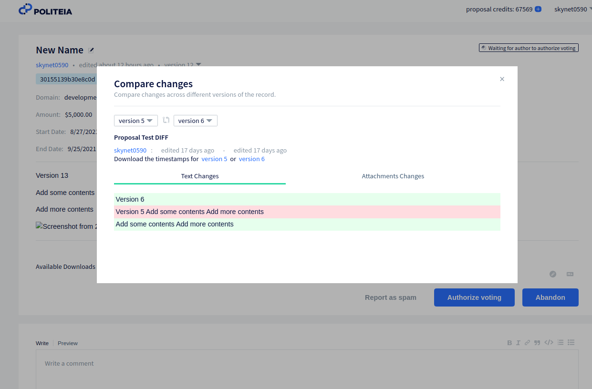

# Revista Decred Agosto 2021

- Politeia v1.1.0 se lanzó y se implementó en el sitio de propuestas donde se agregaron nuevas funciones incluidos metadatos expandidos y una interfaz de usuario mejorada.
- El precio del ticket finalmente estableció un nuevo máximo histórico de 321, el cual superó los picos en la historia de Decred, despejando el camino para referirse a los nuevos precios de tickets ATH sin ninguna calificación sobre los picos tempranos en el precio.
- Progreso sólido en una variedad de repositorios de software de Decred incluyendo el progreso en 3 DCP diferentes (7, 8 y 9) y para el DCRDEX los contratos en Solidity para el comercio de ETH se está llevando revisión en testnet.

Contenido:
- Desarrollo
- Comunidad 
- Gobernanza
- Red
- Ecosistema
- Alcance 
- Medios
- Mercados
- Noticias Relevantes
- Sobre está edición

# Desarrollo
El trabajo que se informa a continuación tiene el estado "fusionado con el maestro" al menos que se indique lo contrario. Significa que el trabajo se completa, se revisa e integra en el código fuente para que los usuarios avanzados puedan [crear y ejecutar](https://medium.com/@artikozel/the-decred-node-back-to-the-source-part-one-27d4576e7e1c) pero aún no está disponible en la versión de binarios para los usuarios habituales.

### [dcrd](https://github.com/decred/dcrd)

[Se ha fusionado](https://github.com/decred/dcrd/pull/2680) la implementación del cambio de consenso de la [Política de Revertir Gastos de la Tesorería](https://github.com/decred/dcps/blob/master/dcp-0007/dcp-0007.mediawiki) (DCP-7) (después de algunos [preparativos](https://github.com/decred/dcrd/pull/2679) para facilitar la revisión). Si se aprueba la votación, el límite de gasto se basará en los ingresos históricos de la tesorería y no en sus gastos históricos lo que a su vez desbloquea la capacidad de utilizar la nueva tesorería descentralizada.

Trabajo fusionado hacia el cambio de consenso sobre las [Revocaciones Automáticas de tickets](https://github.com/decred/dcps/blob/master/dcp-0009/dcp-0009.mediawiki) (DCP-9):

- Se agregó un método para obtener todos los tickets que [vencerán](https://github.com/decred/dcrd/pull/2701) en el siguiente bloque.
- Voto unificado y [validación](https://github.com/decred/dcrd/pull/2702) de revocación.
- Se agregó una función para crear tx de [revocación](https://github.com/decred/dcrd/pull/2707) para un cualquier ticket dado.

Otro trabajo fusionado:

- [Definiciones](https://github.com/decred/dcrd/pull/2713) para el cambio de consenso en [Actualizaciones de Versión Explícita](https://github.com/decred/dcps/blob/master/dcp-0008/dcp-0008.mediawiki) (DCP-8).
- Valores matemáticos [precalculados](https://github.com/decred/dcrd/pull/2690) con optimización para una verificación de firmas ~ 10% más rápida y ~ 400 KiB binario `dcrd` más pequeño.
- [Conversión NAF](https://github.com/decred/dcrd/pull/2695) reescrita para evitar la acumulación de todas las asignaciones y cambiar a un algoritmo más rápido eliminando otro ~ 1% del tiempo de verificación de la firma.
- Métodos agregados para crear y restaurar [snapshots](https://github.com/decred/dcrd/pull/2715) de salidas de coinbase que se puedan gastar (se permitirá pruebas más eficientes).
- Opción de configuración agregada para el [tamaño máximo](https://github.com/decred/dcrd/pull/2711) del archivo de registro antes de rotarlo y comprimirlo.

### [dcrwallet](https://github.com/decred/dcrwallet)

- Se agregó compatibilidad con VSP y mezcla para la solicitud JSON-RPC del [`purchaseticket`](https://github.com/decred/dcrwallet/pull/2064).
- Se agregó el [`processunmanagedticket`](https://github.com/decred/dcrwallet/pull/2075) JSON-RPC del ticket no administrado para asignar un ticket ya existente al VSP en el archivo de configuración del usuario.
- Se agregó el [almacenamiento](https://github.com/decred/dcrwallet/pull/2068) del host VSP y la clave pública para cada ticket en la base de datos de la billetera (esto permite una verificación más eficiente del estado de la tarifa del ticket).
- Se corrigió la [observación](https://github.com/decred/dcrwallet/pull/2076) de direcciones duplicadas (estaba bloqueando el procesamiento de bloques en billeteras muy utilizadas).
- Se corrigieron algunos [detenimientos](https://github.com/decred/dcrwallet/pull/2081) al bloquear o cerrar la billetera.
- Manejo de [reorganización fijo](https://github.com/decred/dcrwallet/pull/2084) y mejorado en modo de sincronización SPV.

### [Decrediton](https://github.com/decred/decrediton)

- Se agregó un botón para [revocar](https://github.com/decred/decrediton/pull/3506) tickets en modo SPV.
- Se reemplazó la configuración del límite de espacio con la acción del [Descubrir Uso de Dirección](https://github.com/decred/decrediton/pull/3532) de una sola vez (que tiene su propio límite de espacio).
- Nuevo diseño de la interfaz de usuario para las páginas [LN Send](https://github.com/decred/decrediton/pull/3538) y [LN Receive](https://github.com/decred/decrediton/pull/3537)

### [Politeia](https://github.com/decred/politeia)

Politeia v1.1.0 se ha lanzado e implementado en [proposals.decred.org](https://proposals.decred.org/). Aspectos destacados de la versión:

- Los autores de las propuestas ahora deben completar el monto de la financiación, las fechas de inicio y finalización y el dominio cuando lo suban a la plataforma (propuestas recientes como [esta](https://proposals.decred.org/record/58d9f46) muestran estos nuevos datos en la parte superior).
- Se [combinaron](https://github.com/decred/politeiagui/pull/2431) las pestañas en `In Discussion`  y `Voting` en una pestaña en `Under Review` para ayudar a los usuarios a ver rápidamente si se están votando en alguna propuesta.
- Se puede ver el Markdown sin procesar.
- Se puede ver quién censuró la propuesta y la razón por lo que lo hizo.
- Muchas correcciones y mejoras de UI / UX
- Las notificaciones por correo electrónico ahora tienen una tasa limitada para evitar que los usuarios malintencionados activen demasiadas y hagan que Politeia sea marcado como un servidor de correo no deseado.
- La base de datos de usuario se movió a MySQL para eliminar CockroachDB como dependencia y tener solo una instancia de base de datos para administrar.

Para obtener más detalles puedes consultar las notas de la versión en los repositorios [politeia](https://github.com/decred/politeia/releases/tag/v1.1.0) y [politeiagui](https://github.com/decred/politeiagui/releases/tag/v1.1.0).

Cambios orientados al usuario fusionados en el maestro (publicación v1.1.0):

- Se permite al usuario [comparar](https://github.com/decred/politeiagui/pull/2524) dos versiones de propuestas.
- Se puede resaltar comentarios de [votos](https://github.com/decred/politeiagui/pull/2520) inmediatamente pero mostrará un error si la solicitud del servidor falla.
- ~ 7 correcciones de errores

Cambios en el backend, internos y en la línea de comandos (publicación v1.1.0):

- Verificación de la [contraseña](https://github.com/decred/politeia/pull/1490) antes de costosas operaciones de billetera en el comando de votación `politeiavoter`.
- Valores de [monedas](https://github.com/decred/politeia/pull/1488) legibles por humanos en la salida de la herramienta `pictl` (por ejemplo, al enviar nuevas propuestas con ella).
- Protección CSRF agregada a la ruta de [inicio de sesión](https://github.com/decred/politeia/pull/1481).
- Estados de [facturación agregados](https://github.com/decred/politeia/pull/1480) (Activo, Cerrado, Completado) para marcar si se puede facturar o no una propuesta aprobada.
- Requerimiento en los campos de [extra data](https://github.com/decred/politeia/pull/1487) estén firmados al publicar o editar `comentarios`, y solo permitir esos datos si están configurados en el complemento de `comments` (el propósito de estos campos es ampliar el complemento de comentarios con una nueva funcionalidad).
- Se permite que los autores de propuestas publiquen [actualizaciones](https://github.com/decred/politeia/pull/1491) sobre las propuestas aprobadas. Cada actualización inicia un nuevo hilo de comentarios donde los usuarios pueden responder y votar, hasta que un administrador marca la propuesta como Completada o Cerrada.
- Mayor cobertura de prueba.

### [vspd](https://github.com/decred/vspd)

- Mejoras en el manejo de [señales](https://github.com/decred/vspd/pull/293) portado de otros proyectos.
- Reparaciones y mantenimientos más pequeños.

### [dcrlnd](https://github.com/decred/dcrlnd)

- Actualización a la [última](https://github.com/decred/dcrlnd/pull/138) dcrd y dcrwallet.
- Se agregó un [script](https://github.com/decred/dcrlnd/pull/139) para generar una red de simulación para testing.
- Se agregó [compatibilidad con SPV](https://github.com/decred/dcrlnd/pull/140) en el modo de billetera integrada (el modo de billetera integrado + el modo SPV combinado permiten ejecutar dcrlnd sin dcrd y dcrwallet).

### [DCRDEX](https://github.com/decred/dcrdex)

Orientado al usuario:

- Revisón del sistema de [credenciales](https://github.com/decred/dcrdex/pull/1015) de cliente. Las claves privadas para cada nueva cuenta DEX ahora se derivan de una única semilla de aplicación y la clave pública del servidor. Además, la contraseña de la aplicación única que se utiliza para cifrar los datos confidenciales del usuario se reemplaza por un par de claves donde la clave "interna" se cifra con la clave "externa". Esto elimina la necesidad de volver a cifrar todos los datos protegidos cuando se cambie la contraseña (y la clave externa).
- Se agregó un punto final para devolver la [app seed](https://github.com/decred/dcrdex/pull/1149) si se proporciona la contraseña de la app correcta.
- Se agregó una casilla de verificación para [recordar la contraseña](https://github.com/decred/dcrdex/pull/1119) durante la duración de la sesión.
- Informar al usuario de los mercados disponibles y los tamaños de los lotes antes de que se pague la tarifa de [registro](https://github.com/decred/dcrdex/pull/1135).
- Permitir a los clientes [cancelar](https://github.com/decred/dcrdex/pull/1133) pedidos mientras un mercado este suspendido.
- Se corrigió problemas de [desplazamiento](https://github.com/decred/dcrdex/pull/1142).

Interno:

- Se utilizaron [filtros compactos](https://github.com/decred/dcrdex/pull/954) en el cliente para localizar los reembolsos de contratos de contraparte en lugar de tirar bloques para verificar.
- No a la difusión de intercambios si hay algún problema para generar o firmar el [reembolso tx](https://github.com/decred/dcrdex/pull/1166).
- Soporte inicial de [internacionalización](https://github.com/decred/dcrdex/pull/1051) en el cliente (en código Go, HTML y JS).
- Comprobación automático si es necesario volver a generar las plantillas [localizadas](https://github.com/decred/dcrdex/pull/1167).
- Se corrigieron algunos [detenimientos](https://github.com/decred/dcrdex/pull/1150) de apagado.
- [Pruebas de reorganización](https://github.com/decred/dcrdex/pull/669) arregladas y mejoradas.

Soporte en Ethereum:

- versión inicial del [smart contract](https://github.com/decred/dcrdex/pull/1019) en Solidity para intercambios de ETH. Como dice el [README](https://github.com/decred/dcrdex/tree/a7046c670b4f824b7b5e237c9efcecbd8fc5e604/dex/networks/eth/contracts) aún no está probado y no es seguro para su uso en la red principal y está destinado a ser una [prueba del concepto](https://en.wikipedia.org/wiki/Proof_of_concept#Software_development) de los intercambios de ETH. Este RP generó mucho conocimiento sobre Ethereum y la seguridad de los contratos y trajo consigo pruebas de [código](https://github.com/decred/dcrdex/blob/a7046c670b4f824b7b5e237c9efcecbd8fc5e604/client/asset/eth/rpcclient_harness_test.go#L706) para detectar la vulnerabilidad de un ataque de reentrada.
- aproximación adicional del [costo del gas](https://github.com/decred/dcrdex/pull/1157) de intercambio.

La mayoría de estos cambios apuntan al [hito de la v0.3](https://github.com/decred/dcrdex/milestone/12) pero algunos se respaldaron en la rama de la versión [v0.2.x](https://github.com/decred/dcrdex/commits/release-v0.2).

Echa un vistazo al [episodio 42](https://www.youtube.com/watch?v=dRjAalxS3r8) de Decred in Depth donde @chappjc respondió preguntas de la comunidad sobre DCRDEX y cómo trabajar como desarrollador en Decred.

### [dcrandroid](https://github.com/planetdecred/dcrandroid)

Combinado en la biblioteca [dcrlibwallet](https://github.com/planetdecred/dcrlibwallet) (compartida por dcrandroid, dcrios y godcr):

- Soporte en votaciones en [Politeia](https://github.com/planetdecred/dcrlibwallet/pull/202).
- Un filtro para buscar tickets [sin minar](https://github.com/planetdecred/dcrlibwallet/pull/205) (aquellos sin confirmaciones).
- Función para obtener tiempo hasta el próximo cambio de [precio del ticket](https://github.com/planetdecred/dcrlibwallet/pull/204).

Fusionado en dcrandroid:

- Implementación del [modo oscuro](https://github.com/planetdecred/dcrandroid/pulls?q=is%3Apr+dark+merged%3A2021-08-01..2021-08-31+sort%3Aupdated-asc).
- Se agrego diálogo entre [detalles](https://github.com/planetdecred/dcrandroid/pull/573) de transacción para tickets.
- Actualización de traducción en [Francés](https://github.com/planetdecred/dcrandroid/pull/576).
- [Actualización](https://github.com/planetdecred/dcrandroid/pull/571) entre dependencias y migración al estilo de código Kotlin.
- Se corrigió la [vulnerabilidad](https://github.com/planetdecred/dcrandroid/pull/581) "StrandHogg" (donde las aplicaciones maliciosas pueden secuestrar las tareas de Android).

### [dcrios](https://github.com/planetdecred/dcrios)

- Objetivo de implementación mínimo cambiado a [iOS 12](https://github.com/planetdecred/dcrios/pull/816).
- ~ 2 correcciones de errores.

### [godcr](https://github.com/planetdecred/godcr)

- Implementación para la votación en [Politeia](https://github.com/planetdecred/godcr/pull/542)
- Visualización informativa de listas de [transacciones](https://github.com/planetdecred/godcr/pull/582) y detalles.
- [Notificaciones](https://github.com/planetdecred/godcr/pull/518) de escritorio agregadas cuando se detecta una nueva transacción o propuesta entrante.
- Nuevo sistema para [notificaciones](https://github.com/planetdecred/godcr/pull/540) dentro de la aplicación (brindis) y del sistema operativo.
- Se muestra el tiempo hasta el próximo cambio de [precio del ticket](https://github.com/planetdecred/godcr/pull/565).
- Notificaciones personalizadas para [Stake tx](https://github.com/planetdecred/godcr/pull/560).
- Implementación de la navegación hacia [atrás](https://github.com/planetdecred/godcr/pull/557).
- Se agregó información sobre herramientas [flotantes](https://github.com/planetdecred/godcr/pull/488) para los datos del ticket.
- Se introdujo [LinearLayout](https://github.com/planetdecred/godcr/pull/563) para simplificar el código de diseño.
- Refactorización y limpieza de código.
- ~ 20 correcciones de errores.

### [dcrdata](https://github.com/decred/dcrdata)

- Migración hacia la nueva [API de Politeia](https://github.com/decred/dcrdata/pull/1829).
- Actualizaciones de dependencia y refactorización en preparación para lanzar la rama v6.0.

Otro:

- El programa Bug Bounty publicó una [actualización](https://bounty.decred.org/2021/08/status-update/): se han parcheado 2 vulnerabilidades y se han hecho públicas, sus autores se han agregado al [Salón de la Fama](https://bounty.decred.org/#hall_of_fame).

## Comunidad

Felicitaciones a los nuevos contratistas a quienes se les otorgó la Autorización de Contratista Decred (DCC): [¡@vibros68!](https://github.com/vibros68)

@raedah dio una interesante entrevista para la revista Authority Magazine hablando sobre distintos temas, su experiencia de vida y Decred.

> *¿Puedes darnos tú "Cita de lección de vida" favorita? ¿Puedes compartir cómo eso fue relevante para ti en tu vida?*

Jiddu Krishnamurti dijo en algunos de sus libros: "No puedes beber la palabra agua" y "Si el agua está limpia, bébela". Estos eran simples indicadores sobre la realidad de que la palabra o idea no es lo mismo que la cosa en sí y que necesitaremos poder usar nuestro propio juicio para determinar si una cosa es buena en lugar de buscar alguna autoridad externa que nos diga qué es cierto, bueno o correcto. Dio discusiones sobre nosotros como nuestra propia fuente de autoridad en nuestras vidas en lugar de ceder nuestro poder a otros o instituciones sociales. Era el mejor tipo de gurú porque no quería ser el gurú de nadie. Solo quería despedirlos y devolverles su poder. Los mejores profesionales de negocios que conozco también hacen esto. Su objetivo no es hacer que la empresa dependa de ellos para crear seguridad laboral sino resolver los problemas y automatizar su trabajo para que su función ya no sea necesaria. En ese momento pueden pasar a resolver el próximo desafío.

Puedes consultar la sección de Medios para ver otras entrevistas con miembros de la comunidad Decred.

Estadísticas de la comunidad a partir del 1 de septiembre:

- Seguidores de [Twitter](https://twitter.com/decredproject): 48 161 (+575)
- Suscriptores de [Reddit](https://www.reddit.com/r/decred/): 11 597 (+148)
- Usuarios en la sala #general de [Matrix](https://chat.decred.org/): 522 (+9)
- Usuarios de [Discord](https://discord.com/invite/GJ2GXfz): 2 124 (+164)
- Usuarios de [Telegram](https://t.me/Decred): 2 846 (+13)
- Suscriptores de [Youtube](https://www.youtube.com/decredchannel): 4 610 (+10) views: 194 000  (+3 000)

## Gobernanza

En agosto, el nuevo fondo de la [tesorería](https://dcrdata.decred.org/treasury?chart=balance&zoom=knj8yxs0-ktmgrvk0&bin=month) recibió 10 942 DCR por un valor de 1.76 millones de dólares a la tasa promedio de agosto de 161.24 dólares. Se gastaron 845 DCR para pagar a los contratistas por un valor de $136 000 a la tasa de agosto o bien $108 000 a la tasa de facturación de julio de $127.48. Al 2 de septiembre el saldo combinado de la nueva tesorería [heredada](https://dcrdata.decred.org/address/Dcur2mcGjmENx4DhNqDctW5wJCVyT3Qeqkx?chart=balance&zoom=ijhhasg0-kse64gw0&bin=month) es de 713 371 DCR (129 millones de dólares a 187.50 dólares).

En agosto se publicaron dos nuevas propuestas, se comenzó a votar ambas a principios de septiembre:

- Una tercera [propuesta](https://proposals.decred.org/record/58d9f46) de Monde PR para renovar el esfuerzo de relaciones públicas de @lindseymmc por un año más a un costo de $42 000.
- Una [propuesta](https://proposals.decred.org/record/150cf81) de @ finstreet21 para producir una serie de videos educativos sobre Decred para el mercado de India a un costo de $ 9 800 divididos en tres hitos.

Las dos propuestas presentadas en julio que tuvieron votación en agosto fueron rechazadas:

- La [propuesta](https://proposals.decred.org/record/ae609f1) de financiar un documental de @frizzers a un costo de $295 000 fue rechazada con una aprobación del 12.5% y una participación del 67%.
- La propuesta de financiar la participación en la Dubai Crypto Expo fue rechazada con una aprobación del 37.5% y una participación del 67%. NOLINK

Consulte el [issue #46](https://blockcommons.red/politeia-digest/issue046/) de Politeia Digest para obtener más detalles sobre las propuestas del mes.
## Red

**Hashrate:** el [hashrate](https://dcrdata.decred.org/charts?chart=hashrate&zoom=krrqjgnz-kt1oo9gz&scale=linear&bin=block&axis=time) de agosto se abrió a ~ 316 Ph / s y cerró ~ 360 Ph / s, tocando fondo en 164 Ph / s alcanzando un máximo de 413 Ph / s durante todo el mes.

Distribución del hashrate [reportada](https://miningpoolstats.stream/decred) en los pools el 1 de septiembre:

- Poolin 36%
- F2Pool 29%
- AntPool 16%
- BTC.com 8%
- Easy2Mine 5%
- Luxor 3%
- ViaBTC 1.6%
- HuobiPool 1.3%
- OKEx 0.14%
- CoinMine 0.08%
- UUPool 0.07%.

Estos porcentajes se basan en los 244 Ph / s atribuidos a grupos conocidos y no incluyen ~ 90 Ph / s de mineros desconocidos.

La distribución de 1 000 bloques [minados](https://miningpoolstats.stream/decred) antes del 1 de septiembre coincidió estrechamente con el hashrate informado.

**Staking:** el [precio de los tickets](https://dcrdata.decred.org/charts?chart=ticket-price&zoom=krrqjgnz-kt1oo9gz&bin=window&axis=time&visibility=true-true) varió entre 120.1 – 321.6 DCR con un [promedio](https://dcrstats.com/) de 30 días de 193.8 DCR (+3.1).

La [cantidad bloqueada](https://dcrdata.decred.org/charts?chart=ticket-pool-value&zoom=krrqjgnz-kt1oo9gz&scale=linear&bin=block&axis=time) fue de 7.23 a 8.12 millones DCR lo que significa que entre el 54.5 y 61.1% del suministro circulante [participó](https://dcrdata.decred.org/charts?chart=stake-participation&zoom=krrqjgnz-kt1oo9gz&scale=linear&bin=block&axis=time) en el proof-of-stake.

El precio del ticket [bajó](https://www.reddit.com/r/decred/comments/p4drzc/whats_up_with_the_decred_ticket_price/) a 120 DCR y luego se disparó a un nuevo máximo histórico de 321.6 DCR. La participación del staking también alcanzó un nuevo ATH del 61.1%.

**VSP:** El 1 de septiembre los servidores vspd [administraron](https://decred.org/vsp/) ~ 8 100 (-500) tickets en vivo y los servidores dcrstakepool enumerados aproximadamente ~ 250 (-150). En conjunto, los 11 VSP heredados y los 15 nuevos administraron el 21% (-1.9%) del grupo de tickets. Los VSP heredados excluidos de la lista que aún siguen activos administraron 40 tickets en vivo.

**Nodos:** a lo largo de agosto hubo alrededor de 205 nodos accesibles según [dcrextdata](https://analytics.planetdecred.org/).

Versiones de nodo a partir del [snapshot](https://nodes.jholdstock.uk/user_agents) del 1 de septiembre (252 dcrd nodos):

- v1.6.2–56%
- v1.6.0–14%
- v1.6.1–12%
- v1.7 dev builds — 13%
- v1.6 dev builds — 2.4%
- v1.5.2–2%
- v1.5.1–0.4%.

La proporción de [monedas mezcladas](https://dcrdata.decred.org/charts?chart=coin-supply&zoom=jyefppu5-kub1inpe&bin=day&axis=time&visibility=true-true-true) varió entre el 46.1% y el 50.5% cruzando el [hito](https://twitter.com/lukebp_/status/1427980967789187076) del 50%. La [cantidad diaria mezclada](https://dcrdata.decred.org/charts?chart=privacy-participation&zoom=jzuht6o0-ktjb6dc0&bin=day&axis=time&visibility=true-false) varió entre 200 000 a 786 000 DCR donde también se estableció un nuevo récord.

Muchos nuevos máximos históricos se han [resumido](https://twitter.com/TheBochinchero/status/1433834350353784875) muy bien en el último resumen de métricas en cadena de @bochinchero.
## Ecosistema

Bienvenido el [nuevo](https://github.com/decred/dcrwebapi/pull/147) VSP en [synergy-crypto.net](https://vspd.synergy-crypto.net/) con una tarifa del 0.75% (muchas gracias por ejecutarla en una instancia de [testnet](https://vspd-testnet.synergy-crypto.net/)).

Los siguientes VSP heredados se han eliminado de la [lista](https://decred.org/vsp/) pública:

- [dcr.farm](https://vsp.dcr.farm/): su página heredada se ha redirigido a vspd desde junio (cuando tenía 32 tickets en vivo)
- [stakey.net](https://stakey.net/): la página ha sido reemplazada con vspd UI, pero su [API heredada](https://stakey.net/api/v2/stats) aún está activa e informa cuántos tickets en vivo quedan (38 a partir del 1 de septiembre).

[raqamiya.net](http://raqamiya.net/) ha cerrado su VSP heredado. El procedimiento de cierre comenzó en marzo cuando se [eliminó](https://github.com/decred/dcrwebapi/pull/132) de la lista y se notificó a los usuarios por correo electrónico, sitio web y la edición de la [Revista Decred Marzo](https://github.com/DecredES/translations/blob/master/decredJournal/2021/03/index.md#integraciones) para que no compraran tickets nuevos. Luego Raqamiya continuó votando sobre los tickets existentes durante ~ 4 meses antes de cerrar el 16 de agosto. Algunos usuarios se perdieron todos los avisos y siguieron asignando tickets a este VSP hasta el final lo que resultó en 11 tickets en vivo en el momento del cierre. Esto puede suceder con cualquier VSP heredado porque [dcrstakepool](https://github.com/decred/dcrstakepool) no tiene forma de rechazar los registros de tickets (a diferencia del nuevo protocolo vspd).

Para cualquier persona que todavía use VSP heredado se recomienda cambiar a [proveedores de vspd](https://decred.org/vsp/) para evitar el riesgo de la perdida de tickets, p. Ej. como resultado del cierre o si dcrstakepool deja de funcionar con las próximas actualizaciones de consenso. A partir del 1 de septiembre los VSP heredados administraron menos de 300 tickets o el 0.7% del grupo de tickets.

Nuevas integraciones en Exchanges:

- Bitfinex [lanzó](https://twitter.com/bitfinex/status/1423210403774009345) el trading del par DCR / USD
- El Exchange de [Bitcoin.com](http://bitcoin.com/) [habilitó](https://twitter.com/BitcoinComExch/status/1423589830672457733) el trading con los pares entre DCR con BTC, ETH y USDT

Hotbit Korea ha eliminado su par DCR / KRW según lo [informado](https://twitter.com/DecredKorea/status/1425751145796956167) por @DecredKorea (el par se lanzó en [noviembre del 2020](https://twitter.com/Hotbit_Korea/status/1331412789416534017)).

*Advertencia: los autores de la revista Decred no tienen idea de la confiabilidad de ninguno de los servicios mencionados anteriormente. Haga su propia investigación antes de confiar su información personal o sus activos a cualquier entidad.*

Únase a nuestro chat [#services](https://chat.decred.org/#/room/#services:decred.org) para seguir las actualizaciones del ecosistema Decred.
## Alcance

Monde PR tuvo un mes reducido en labor después de que su segunda [propuesta](https://proposals-archive.decred.org/proposals/c81926b) terminara en julio. @l1ndseymm estuvo manteniendo oportunidades y trabajo actuales. También se mantuvo respondiendo a las consultas entrantes mientras elaboraba la [tercera propuesta](https://proposals.decred.org/record/58d9f46) la cual comenzó a votarse en septiembre.
## Eventos

Decred se convirtió en partidario de un programa educativo sobre tecnología de cripto y blockchain organizado por la Escuela de Negocios de la Universidad Católica de Argentina y la ONG Bitcoin Argentina. Decred fue [invitado](https://matrix.to/#/!clHjlICBEtCtAdTupf:decred.org/$-CkRPUnXB8spWofBTk3nA3UAr2u4ofpCIzaoCJuoUag) como resultado de conexiones pasadas entre Bitcoin Argentina y nuestro equipo de alcance [español](https://twitter.com/Decred_ES) donde se incluyó materiales de marketing (junto con otras marcas). El [taller](http://uca.edu.ar/es/blockchain-y-criptoactivos) comenzó el 8 de septiembre y tendrá una duración de 10 semanas.
## Medios

**Artículos seleccionados:**

- The Suppressor parte 1: Guerra de desgaste por @tacorevenge ([medium](https://medium.com/@tacorevenge/the-suppressor-part-1-war-of-attrition-3081a61b202b))
- El Futuro Es Ahora: Steven Wagner De Raedah Group Habla Sobre Cómo Su Innovación Sacudirá La Escena Tecnológica por Fotis Georgiadis (medium)(poner el link en el articulo en español)
- Una de las criptomonedas mas rentables para la minería es una de la que quizás nunca hayas oído hablar y ha subido un 1 300% desde su mínimo del 2020. El CEO de la granja minera, Josh Metnick explica la criptografía y qué mineros y grupos usar por Laila Maidan ([businessinsider.com](https://www.businessinsider.com/profitable-crypto-to-mine-according-to-ceo-mining-farm-navier-2021-8?r=MX&IR=T) paywalled ([tipo de](https://twitter.com/exitusdcr/status/1429414135582937088)...))

> “Es un proyecto legítimo en toda su extensión. En términos relativos, como en los años criptográficos, ha existido por un tiempo. Y hay algunas personas inteligentes y éticas involucradas en eso ” dijo Metnick.

**Videos:**

- Decred in Depth #41 — Stephen Palley + Gabriel Shapiro (Lexnode) + Luke Powell por @elima_iii ([youtube](https://www.youtube.com/watch?v=9TXoyRv_Z8U))
- Decred in Depth #42 — Jonathan Chappelow + DCRDEX por @elima_iii ([youtube](https://www.youtube.com/watch?v=dRjAalxS3r8))
- Decred News August — Blockchain governance in action, new network highs, exciting proposals & more! por @Exitus ([youtube](https://www.youtube.com/watch?v=6ifueUAWy_c))
- Decred’s ticket voting system — Decred Fundamentals por @phoenixgreen ([youtube](https://www.youtube.com/watch?v=LEO0vHdY3gs))
- Tax education and Decred por @phoenixgreen ([youtube](https://www.youtube.com/watch?v=-26obfV2e84))
- Decred is heating up for something big por @phoenixgreen ([youtube](https://www.youtube.com/watch?v=n6ATfW_vnCg))
- Decred Price Analysis — 4th August 2021 por Brave New Coin ([youtube](https://www.youtube.com/watch?v=NOlvAI43VSY))

Chris Burniske mencionó a Decred en una entrevista de julio en [Original Sins of Crypto](https://www.youtube.com/watch?v=gLbzfZKf_ro&t=3942s) con Jason Yanowitz de Blockworks:

> Jason: Sin embargo ¿cómo se puede confiar? Como si todo el mundo es democrático, hasta que obtienen el poder y luego el poder los corrompe. Me encanta el concepto de DAO y me encanta el concepto de DeFi , pero mi mayor preocupación es ¿estamos confiando en estos "CEO de DeFi DAO" en que se descentralizarán y cederán poder?

Chris: Realmente depende de la génesis de la DAO. No todos los DAO son iguales. Aquí es donde para mí el estándar de oro de cómo se inició un DAO sigue siendo Decred.

**Traducciones:**

La Revista Decred de julio del 2021 se [tradujo](https://xaur.github.io/decred-news/) al árabe (@arij, @ abdulrahman4), chino (@Dominic) y español (@francov_). ¡Gracias a todos los traductores por correr la voz!

Comparta sus traducciones en nuestra sala de chat [#translations](https://chat.decred.org/#/room/#translations:decred.org).
## Mercados

En agosto, DCR cotizaba entre 126.50–181.26 USD/ BTC 0.0032–0.0038. La tarifa promedio diaria fue de $161.24.

dcrdata ahora [muestra](https://twitter.com/longtermdaily/status/1433148588608004097) el historial de [precios](https://explorer.dcrdata.org/market?chart=candlestick&xc=dcrdex&bin=1d) y [volumen](https://explorer.dcrdata.org/market?chart=volume&xc=dcrdex&bin=1d) de operaciones para el par BTC / DCR en DCRDEX.

Un nuevo colaborador misterioso @tacorevenge publicó la [primera parte](https://medium.com/@tacorevenge/the-suppressor-part-1-war-of-attrition-3081a61b202b) de una investigación de la entidad The Suppressor que algunos miembros de la comunidad sospechan de manipulación de los mercados de DCR.

## Noticias Relevantes

Algunos legisladores estadounidenses se volvieron sorprendentemente selectivos con los algoritmos de consenso y solo excluyeron la [minería de prueba de trabajo](https://news.bitcoin.com/white-house-backs-crypto-tax-amendment-endorsing-proof-of-work-infrastructure-bill/) (proof-of-work)de la definición de "intermediarios" que incluye "cualquier persona que (por consideración) sea responsable y proporcione regularmente cualquier servicio que efectúe transferencias de activos digitales".  Esta amplia definición ha sido [criticada](https://twitter.com/jchervinsky/status/1421150347788263433) por aplicarse potencialmente a prácticamente todos los actores económicos de la industria y se convirtió en un tema del esfuerzo de cabildeo criptográfico para reemplazar ese lenguaje por otro que sea más específico y excluya explícitamente a todos los validadores y desarrolladores de software. Hubo una versión de esta misma ley que contó con el apoyo de varios senadores que habría restringido el lenguaje de esta manera, pero debido al procedimiento del Senado no se consideraron enmiendas y fue así que la versión con la definición más amplia se [pasó](https://www.coindesk.com/markets/2021/08/10/us-senate-sends-infrastructure-bill-to-house/) a la Cámara de Representantes. 

A16Z un VC con participaciones en muchas redes criptográficas ha [publicado](https://a16z.com/2021/08/26/open-sourcing-our-token-delegate-program/) su "Programa de delegado de tokens". El documento explica por qué A16Z ha decidido delegar sus derechos de voto (tienen tantos tokens que la toma de decisiones estaría centralizada de otra manera). También explica cómo eligen a los delegados siendo alrededor del 50% de sus delegaciones son destinadas para organizaciones universitarias y el resto para startups y organizaciones sin fines de lucro.

Una propuesta de Uniswap de Flipside crypto causó cierta [controversia](https://twitter.com/DuneAnalytics/status/1428250340139356164) en la comunidad ya que pasó rápidamente por las primeras rondas de votación donde habría utilizado $25 millones en UNI para generar un rendimiento que pagó al equipo de Flipside para producir "análisis habilitados para la comunidad". Una de las cuestiones planteadas fue que las entidades nombradas para supervisar la subvención incluían personas que se beneficiarían de ella. Todos los demás proveedores de análisis no se sintieron impresionados por el intento de Flipside de lograr que UNI financiara a 8 empleados a tiempo completo para su empresa.

La manía de los NFT´s alcanzó nuevas alturas con la llegada de [LOOT](https://techcrunch.com/2021/09/03/loot-games-the-crypto-world/) (para aventureros), imágenes con texto blanco que describen elementos del juego de aventuras sobre un fondo negro que pronto se vendieron por más de 10 ETH cada una. La idea detrás de LOOT es que una vez que se determina inicialmente el rango de elementos y su escasez la gente agregará todos los aspectos generalmente asociados con los juegos (representación visual del elemento, estadísticas, un mundo de juego para usarlo) después. Parece que se ha prestado poca atención a incentivar este trabajo hasta ahora sin embargo, la característica principal de LOOT en esta etapa parece que le da derecho al poseedor a recibir una variedad de lanzamientos desde el aire igualmente vacíos. ¿Estamos pasando de "constrúyalo y ellos vendrán" para "venderles algunos marcadores de posición por un precio alto y alguien seguramente aparecerá y lo construirá"?

Además, parece que la llegada de LOOT fue muy bien [aprovechado](https://twitter.com/IAMTHETORN/status/1434401460876369923) por personas que tienen conocimientos sobre el tema en donde pudieron garantizar guardar items raros en sus bolsas.

Un falso NFT Banksy se [vendió](https://www.cnbc.com/2021/09/01/banksy-website-promotes-fake-nft-in-apparent-hack.html) por $300 000 después de que aparentemente el sitio web del artista de grafiti fuera hackeado para agregar una página que presentaba este NFT y un enlace a su listado en Opensea. Posteriormente el estafador devolvió el ETH del comprador por razones no declaradas.

Eso es todo por agosto. Comparta sus actualizaciones para el próximo número en nuestra sala de chat [#journal](https://chat.decred.org/#/room/#journal:decred.org).

# **Sobre esta edición**

Esta es la edición #41 de la Revista Decred. Un índice de todas las ediciones, y traducciones están disponibles [aquí](https://xaur.github.io/decred-news/).

*La mayoría de la información de terceros se transmite directamente desde la fuente después de un control de fiabilidad mínimo. Los autores de la Revista Decred no tienen la capacidad de verificar todas las reclamaciones. Tenga cuidado con las estafas y haga su propia investigación.*

Créditos (por orden alfabético):

- Escritura y redacción: bee, degeri, richardred
- Revisión y comentarios: davecgh, l1ndseymm, lukebp, matheusd
- Imagen de portada: saender
- Financiado por: Los stakeholders de Decred
