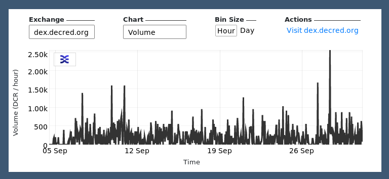

# Revista Decred Septiembre 2021

Lo más destacado de septiembre:

-   Se ha completado el trabajo sobre los cambios de consenso de DCP-8 y DCP-9, están listos para ser presentados para una votación en cadena para ratificarlos.
-   Politeia se ha actualizado a v1.2, agregando características como actualizaciones de propuestas y la capacidad de hacer comparaciones entre dos versiones de una propuesta.
-   Las billetera móviles de Android e iOS vieron nuevos lanzamientos en sus respectivas tiendas de aplicaciones.
-   GoDCR alcanzó su primera construcción de red de prueba funcional, lo que demuestra lo que se ha logrado con ese proyecto hasta ahora, ya que se publicó y discutió la propuesta para la financiación continua de GoDCR.

Contenido:

- Desarrollo

- Comunidad

- Gobernanza

- Red

- Ecosistema

- Alcance

- Medios

- Mercados

- Noticias Relevantes

## Desarrollo

## Comunidad

¡Bienvenido al nuevo contribuyente con código fusionado en la rama master: @naveensrinivasan ([dcrd)](https://github.com/decred/dcrd/commits?author=naveensrinivasan)!

Estadísticas de la comunidad a partir del 2 de octubre:

-   Seguidores de [Twitter](https://twitter.com/decredproject): 48 673 (+512)
-   Suscriptores de [Reddit](https://www.reddit.com/r/decred/): 11 954 (+357)
-   Usuarios en la sala #general de [Matrix](https://chat.decred.org/): 535 (+13)
-   Usuarios de [Discord](https://discord.com/invite/GJ2GXfz): 2 077 (-47)
-   Usuarios de [Telegram](https://t.me/Decred): 2 909 (+63)
-   Suscriptores de [Youtube](https://www.youtube.com/decredchannel): 4 610 (+0) views: 196 000 (+2 000)

**Gobernanza**
--------------

En septiembre, el nuevo fondo de la [tesorería](https://dcrdata.decred.org/treasury?chart=balance&zoom=knj8yxs0-ktmgrvk0&bin=month) recibió 10 274 DCR por un valor de 1.4 millones de dólares a la tasa promedio de septiembre de 139.56 dólares. Se gastaron 590 DCR para pagar a los contratistas por un valor de $82 000 a la tasa de septiembre o bien $95 000 a la tasa de facturación de agosto de $161.24. Al 2 de octubre el saldo combinado de la nueva tesorería [heredada](https://dcrdata.decred.org/address/Dcur2mcGjmENx4DhNqDctW5wJCVyT3Qeqkx?chart=balance&zoom=ijhhasg0-kse64gw0&bin=month) es de 723,528 DCR (83.5 millones de dólares a 115.45 dólares).

Se presentaron dos nuevas propuestas, ambas por @raedah, solicitando fondos renovados para [GoDCR](https://proposals.decred.org/record/f7d9fc8) y las [billeteras para móvil](https://proposals.decred.org/record/6db3c4e).

La participación de los votantes alcanzó nuevas alturas y ambos votos de este mes registraron una participación por encima del nivel récord anterior.

-   La [propuesta](https://proposals.decred.org/record/58d9f46) de Monde PR fue aprobada con 97.5% de aprobación y una participación del 75%.
-   La [propuesta](https://proposals.decred.org/record/150cf81) de financiar una serie de videos educativos para el mercado de India, de @ finstreet21 fue rechazada con un 45% de aprobación y una participación del 77%.

La característica de [actualizaciones por parte del autor de propuestas](https://github.com/decred/politeia/issues/1473) tan esperada ahora está disponible en Politeia y ya ha sido utilizada por dos [propuestas de desarrollo](https://proposals.decred.org/record/3a98861) para informar el progreso.

Consulte el [issue 46](https://blockcommons.red/politeia-digest/issue046/) y el [issue 47](https://medium.com/decred-es/politeia-digest-47-septiembre-4-octubre-3-2021-3cb3bb3e6c01) de Politeia Digest para obtener más detalles sobre las propuestas del mes.

**Red**
-------

**Hashrate:** el [hashrate](https://dcrdata.decred.org/charts?chart=hashrate&zoom=krrqjgnz-kt1oo9gz&scale=linear&bin=block&axis=time) de septiembre se abrió a ~355 Ph / s y cerró ~228 Ph / s, tocando fondo en 190 Ph / s alcanzando un máximo de 449 Ph / s durante todo el mes.

Distribución del hashrate [reportada](https://miningpoolstats.stream/decred) en los pools el 1 de octubre:

-   Poolin 36%
-   F2Pool 25%
-   AntPool 22%
-   BTC.com 5%
-   ViaBTC 5%
-   Luxor 3%
-   HuobiPool 1%
-   CoinMine 0.15%
-   OKEx 0.13%.

La distribución de 1 000 bloques [minados](https://miningpoolstats.stream/decred) antes del 1 de octubre coincidió estrechamente con el hashrate informado.

**Staking:** el [precio de los tickets](https://dcrdata.decred.org/charts?chart=ticket-price&zoom=krrqjgnz-kt1oo9gz&bin=window&axis=time&visibility=true-true) varió entre 192.8--210.8 DCR con un [promedio](https://dcrstats.com/) de 30 días de 199.4 DCR (+5.6).

La [cantidad bloqueada](https://dcrdata.decred.org/charts?chart=ticket-pool-value&zoom=krrqjgnz-kt1oo9gz&scale=linear&bin=block&axis=time) fue de 7.69--8.16 millones DCR lo que significa que entre el 57.7 y 61.1% del suministro circulante [participó](https://dcrdata.decred.org/charts?chart=stake-participation&zoom=krrqjgnz-kt1oo9gz&scale=linear&bin=block&axis=time) en el proof-of-stake.

Los precios de los tickets parecen haber alcanzado una estabilización relativa entre dos extremos.

**VSP:** El 1 de octubre los servidores vspd [administraron](https://decred.org/vsp/) ~7,600 (-500) tickets en vivo y los servidores dcrstakepool enumerados aproximadamente ~220 (-30). En conjunto, los 8 VSP heredados y los 15 nuevos administraron el 219% (-2%) del grupo de tickets. Los VSP heredados excluidos de la lista que aún siguen activos administraron 29 (-11) tickets en vivo.

**Nodos:** a lo largo de septiembre hubo alrededor de 204 nodos accesibles según [dcrextdata](https://analytics.planetdecred.org/).

Versiones de nodo a partir del [snapshot](https://nodes.jholdstock.uk/user_agents) del 1 de octubre (257 dcrd nodos):

-   v1.6.2--55%
-   v1.6.0--13%
-   v1.6.1--12%
-   v1.7 dev builds --- 14%
-   v1.6 dev builds --- 2.7%
-   v1.5.2--2%
-   v1.5.1--1.2%.

La proporción de [monedas mezcladas](https://dcrdata.decred.org/charts?chart=coin-supply&zoom=jyefppu5-kub1inpe&bin=day&axis=time&visibility=true-true-true) varió entre el 50.3% y 52.2% y estableció un nuevo récord histórico, mientras que la suma de monedas mixtas no gastadas superó la marca de los 7 millones.

La [cantidad diaria mezclada](https://dcrdata.decred.org/charts?chart=privacy-participation&zoom=jzuht6o0-kv1lwqo0&bin=day&axis=time&visibility=true-false) varió entre 240-550 mil DCR.

**Ecosistema**
--------------

Se recomienda a los usuarios de Matrix que actualicen a sus clientes (especialmente Element) para parchear la [vulnerabilidad](https://matrix.org/blog/2021/09/13/vulnerability-disclosure-key-sharing) de seguridad divulgada el 13 de septiembre. Si la cuenta de un usuario se ve comprometida (ya sea por un compromiso directo de las credenciales de la cuenta o por un servidor doméstico comprometido) en ciertas circunstancias puede que sea posible leer los mensajes cifrados enviados a dicha cuenta desde sus contactos vulnerables. La divulgación señaló: "El mayor riesgo es para los usuarios que se encuentran en salas encriptadas que contienen servidores maliciosos. Los administradores de servidores maliciosos podrían intentar hacerse pasar por los dispositivos de sus usuarios para espiar los mensajes enviados por clientes vulnerables en esa sala ". Como medida de seguridad adicional, puede revisar las sesiones activas y eliminar las obsoletas o sospechosas.

El legado [decredvoting.com](http://decredvoting.com/) se eliminó de la [lista VSP](https://decred.org/vsp/) para facilitar la migración de usuarios al nuevo [sistema vspd](https://blog.decred.org/2020/06/02/A-More-Private-Way-to-Stake/). Las billeteras de votación todavía están en línea para votar los tickets restantes (9 tickets a partir del 1 de octubre). Decred Voting ha prestado [servicios desde 2018](https://www.reddit.com/r/decred/comments/9c6s3l/new_voting_service_provider_aka_stake_pool_is_now/) y es conocido por desarrollar funciones avanzadas como [notificaciones](https://www.reddit.com/r/decred/comments/9oepq6/decredvotingcom_now_supporting_automatic_email/) por correo electrónico en tickets ya votados y un [panel](https://www.reddit.com/r/decred/comments/hbofz4/tired_of_keeping_track_of_your_staking_activities/) de análisis de tickets personalizados y también por ayudar a los pequeños propietarios con [educación](https://medium.com/decred/dcr-ticket-splitting-all-you-need-to-know-b8edc6b65db3) sobre la división de tickets y [funciones](https://www.reddit.com/r/decred/comments/euqd4h/introducing_split_ticket_dashboard_on/) para facilitar su uso.

Para cualquier persona que todavía use VSP heredado, se recomienda cambiar a [proveedores de vspd](https://decred.org/vsp/) para evitar el riesgo de perdida, p. Ej. en caso de que el VSP heredado se apague o deje de funcionar con las próximas actualizaciones de consenso. A partir del 1 de octubre, todos los VSP heredados administraron menos de 250 tickets o el 0.6% del grupo de tickets.

u / daryledesilva [compartió](https://www.reddit.com/r/decred/comments/pp8uu4/decred_dcr_dollar_cost_averaging_dca_calculator/) una [calculadora](https://dcacryptocalculator.com/decred) de promedio de costos en dólares para Decred.

*Advertencia: los autores de la revista Decred no tienen idea de la confiabilidad de ninguno de los servicios mencionados anteriormente. Haga su propia investigación antes de confiar su información personal o sus activos a cualquier entidad.*

Únase a nuestro chat [#services](https://chat.decred.org/#/room/#services:decred.org) para seguir las actualizaciones del ecosistema Decred.

**Alcance**
-----------

Se actualizó la publicación fijada de r / decred para recién llegados: [Bienvenido a Decred: Money Evolved.](https://www.reddit.com/r/decred/comments/pqsmgf/welcome_to_decred_money_evolved/)

@davecgh nos dió un nuevo y fantástico [discurso de Decred](https://www.reddit.com/r/decred/comments/ppmkdm/opinions_on_long_term_value_of_decred_not_asking/hd5kvp0/) que responde cómo Decred es valioso a largo plazo. Versión de Twitter [aquí](https://twitter.com/rstaudt2/status/1443257842920734727).

Logros de Monde PR para septiembre:

-   [Propuesta](https://proposals.decred.org/record/58d9f46) de relaciones públicas aprobada el 14 de septiembre.
-   Actualizó el calendario de relaciones públicas para incluir los próximos anuncios y la actividad de relaciones públicas.
-   Lanzó para Decred dos oportunidades de relaciones públicas.
-   Aseguró dos entrevistas con los medios para Decred.

Se aseguro el siguiente artículo de noticias:

-   @lukebp fue entrevistado por [Cigars and Crypto Podcast](https://www.cigarsandcrypto.com/episode-175-luke-powell-of-the-decred-project/) cubriendo todo lo relacionado con Decred.

## Medios

**Artículos seleccionados:**

- Decred Blockchain Analysis - Part 3 por @richardred ([blockcommons.red](https://blockcommons.red/post/dcr-on-chain-3/)) - explora cuál es la información que se puede encontrar aplicando agrupación de direcciones de todos los tickets en los pools en alturas de bloques específicas. Nota: quedan algunos problemas por solucionar con los resultados.
- Decred address clustering deep dive por @richardred ([blockcommons.red](https://blockcommons.red/publication/clustering-deep-dive/)): un informe  especializado en los desafíos de la agrupación en clústeres, incluye muchos gráficos que muestran el comportamiento de votación de diferentes pools (usuarios) y cómo se ve cuando algo anda mal con uno de ellos.
- A deep dive into how the top 10 DAOs work por Andrey Sergeenkov ([coinmarketcap.com](https://coinmarketcap.com/alexandria/article/a-deep-dive-into-how-the-top-daos-work))

**Videos:**

- Being fork resistant - Decred Fundamentals por @phoenixgreen ([youtube](https://www.youtube.com/watch?v=P2LrIcF_8qw)).
- How is Decred fork resistant? - Fundamentos de Decred @phoenixgreen ([youtube](https://www.youtube.com/watch?v=pmQiU3zycU0))
- Decred in Depth Ep. 43 - Chris Dannen + pensamiento de diseño + futuro de Decred por @elima_iii ([youtube](https://www.youtube.com/watch?v=Cj6PmMza9RQ))
- Decred Price Analysis - 15 de septiembre del 2021 por Brave New Coin ([youtube](https://www.youtube.com/watch?v=qOpLpdBCMI4))

**Audio:**

- Cigars and Crypto 175 - Luke Powell del Proyecto Decred ([cigarsandcrypto.com](https://www.cigarsandcrypto.com/episode-175-luke-powell-of-the-decred-project/))
- Decred Society series de @phoenixgreen se ha publicado en [Apple Podcasts](https://podcasts.apple.com/us/podcast/decred-society/id1586826872).

**Traducciones:**

- [Decred News August](https://www.youtube.com/watch?v=6ifueUAWy_c) - en chino (@Dominic) publicado en plataformas de video chinas como [Bilibili](https://www.bilibili.com/video/BV1QA411c77W), [Weibo](https://passport.weibo.com/visitor/visitor?entry=miniblog&a=enter&url=https%3A%2F%2Fweibo.com%2F6824123103%2FKvXMCaDEW&domain=.weibo.com&sudaref=https%3A%2F%2Fmedium.com%2F&ua=php-sso_sdk_client-0.6.36&_rand=1635107778.4762) y [WeChat](https://mp.weixin.qq.com/s/l1RO1Mkb9LNQK2Z2x1mkyw).
- La Revista Decred de agosto del 2021 se [tradujo](https://xaur.github.io/decred-news/) al árabe (@arij, @ abdulrahman4), chino (@Dominic) y español (@francov_). ¡Gracias a todos los traductores por quedarse!

Comparta sus traducciones en nuestra sala de chat [#translations](https://chat.decred.org/#/room/#translations:decred.org).

**Mercados**
--------

En septiembre, DCR cotizaba entre 96.14--185.79 USD/ BTC 0.0023--0.0038. La tarifa promedio diaria fue de $139.56.

**Noticias Relevantes**
-----------------------

La aplicación de Sushi's Miso fue [utilizado](https://www.coindesk.com/business/2021/09/17/3m-in-ether-stolen-from-sushiswaps-miso-launchpad/) para robar las ganancias de una caída de NFT ($ 3 millones para Kia Sedonas de Jay Pegs Auto Mart). El atacante fue [identificado](https://www.coindesk.com/tech/2021/09/17/3m-was-stolen-but-the-real-steal-is-these-kia-sedonas-say-anonymous-developers/) (mediante el uso del dominio ENS) como un desarrollador de Sushi, que había insertado un código en la interfaz en donde envió los fondos a su propia dirección. Posteriormente los fondos fueron devueltos a sus respectivas cuentas.

La aplicación Compound DeFi implementó nuevos smarts contracts en donde [entregaron](https://www.coindesk.com/tech/2021/09/30/defi-money-market-compound-overpays-15m-in-comp-rewards-in-possible-exploit/) tokens COMP por un valor de 80 millones de dólares de formas no deseadas. El fundador, Robert Leshner, pidió a los destinatarios que devolvieran los tokens y lo describió como un [dilema](https://www.coindesk.com/tech/2021/10/01/compound-founder-says-80m-bug-presents-moral-dilemma-for-defi-users/) moral, después de insinuar inicialmente que las personas que no devuelvan los tokens podrían pasar sus datos a las autoridades de recaudación de impuestos. Un aspecto interesante de la historia es que el problema se identificó con bastante rapidez, pero debido a que cambiar los contracts requiere un proceso de gobernanza, no había forma de implementar una solución rápida y todos los fondos vulnerables se agotaron.

Los usuarios de Coinbase han sido [atacados](https://www.zdnet.com/article/coinbase-sends-out-breach-notification-letters-after-6000-accounts-had-funds-stolen/), parece que alrededor de 6 000 usuarios cuyos datos de inicio de sesión se habían visto comprometidos en otros lugares sufrieron pérdidas en sus cuentas de Coinbase después de que los atacantes explotaran una falla en el proceso de recuperación de dos factores de SMS de Coinbase para eludir esta protección y retirar los fondos de sus víctimas. En una [carta](https://oag.ca.gov/system/files/09-24-2021%20Customer%20Notification.pdf) de notificación a los clientes, Coinbase dijo que la falla se ha solucionado y que todos los clientes afectados serán reembolsados. Esto se debe a un [descontento](https://www.zdnet.com/article/coinbase-sends-out-breach-notification-letters-after-6000-accounts-had-funds-stolen/) más general con el servicio al cliente de Coinbase en el verano.

La Ley de Estructura del Mercado de Activos Digitales y Protección al Inversionista, que se [presentó](https://beyer.house.gov/news/documentsingle.aspx?DocumentID=5307) en julio, continúa recibiendo [cobertura](https://www.jdsupra.com/legalnews/new-us-digital-assets-bill-casts-wide-5957884/) y discusión, lo que indica que recibirá una seria consideración por parte de los legisladores. La Ley propuesta es una de las leyes más amplias para abordar los activos digitales y aclararía cómo los diferentes tipos de activos caerían dentro del ámbito de las diferentes agencias de aplicación. La definición propuesta de un valor se centraría en la equidad o los derechos de voto en la entidad emisora (corporativa) excluyendo la votación sobre asuntos de blockchain como la creación de bloques. También hay un aspecto por el cual la venta de tokens para un producto sin terminar cuya producción será financiada por la venta de tokens (es decir, el modelo ICO) se consideraría valores. Las monedas estables no se podrían crear ni usar sin la aprobación del Secretario del Tesoro y la Reserva Federal recibiría la autoridad para emitir una moneda digital del banco central de EE. UU.

Eso es todo por septiembre. Comparta sus actualizaciones para el próximo número en nuestra sala de chat [#journal](https://chat.decred.org/#/room/#journal:decred.org).

**Sobre esta edición**
======================

Esta es la edición #42 de la Revista Decred. Un índice de todas las ediciones, y traducciones están disponibles [aquí](https://xaur.github.io/decred-news/).

*La mayoría de la información de terceros se transmite directamente desde la fuente después de un control de fiabilidad mínimo. Los autores de la Revista Decred no tienen la capacidad de verificar todas las reclamaciones. Tenga cuidado con las estafas y haga su propia investigación.*

Créditos (por orden alfabético):

-   Escritura y redacción: bee, degeri, l1ndseymm, richardred
-   Revisión y comentarios: davecgh, lukebp
-   Imagen de portada: saender
-   Financiado por: Los stakeholders de Decred

