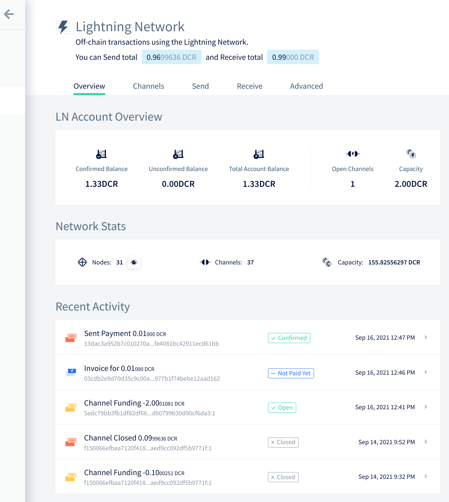
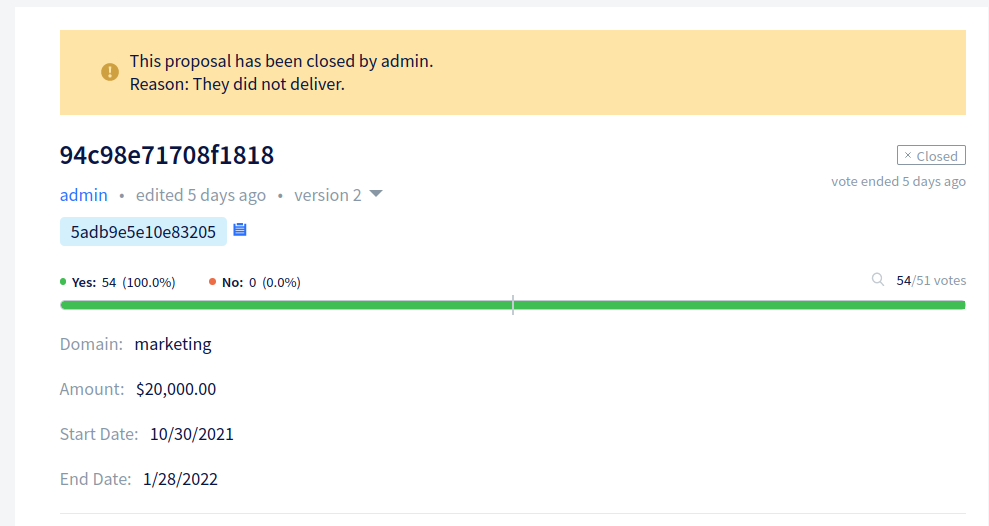
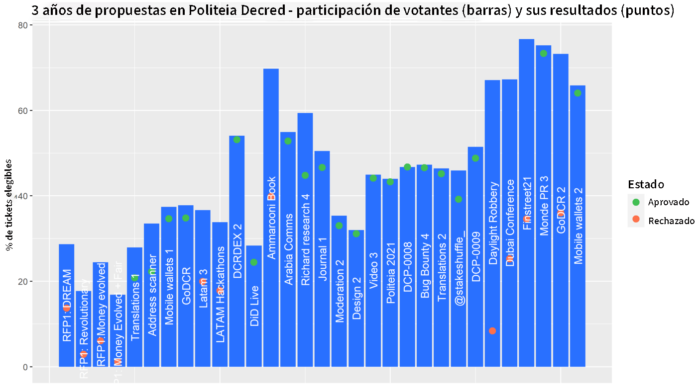
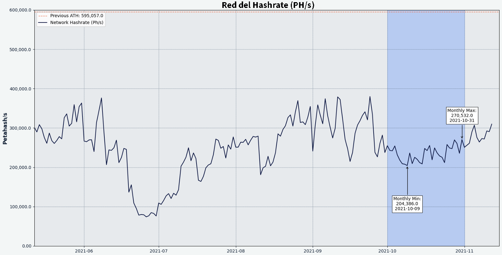
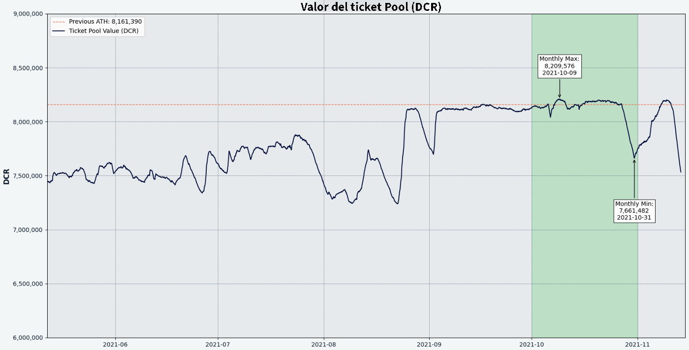
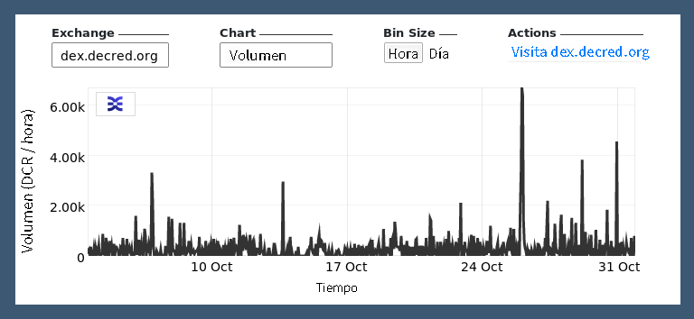

Revista Decred Octubre 2021
===========================

Lo más destacado de octubre:

-   Politeia celebró su tercer año de funcionamiento y tuvo otro mes de desarrollo ajetreado.
-   La propuesta de billeteras móviles de @raedah fue financiada por un año más.
-   La propuesta de GoDCR fue rechazada pero se está preparando una propuesta mejorada. El desarrollo continúa puliendo la billetera para un lanzamiento en la mainnet.
-   Los cambios fusionados en DCRDEX permiten pagar tarifas de registro en BTC y usar una billetera SPV incorporada sin ejecutar un nodo completo de Bitcoin.

**Desarrollo**
--------------

El trabajo que se informa a continuación tiene el estado "fusionado con el maestro" al menos que se indique lo contrario. Significa que el trabajo se completa, se revisa e integra en el código fuente para que los usuarios avanzados puedan [crear y ejecutar](https://medium.com/@artikozel/the-decred-node-back-to-the-source-part-one-27d4576e7e1c) pero aún no está disponible en la versión de binarios para los usuarios habituales.

### [dcrd](https://github.com/decred/dcrd)

*dcrd es una implementación de nodo completo que impulsa la red peer-to-peer de Decred en todo el mundo.*

Cambios fusionados:

-   La actualización de índices (transacción, dirección, dirección existente) se ha hecho [asincrónica](https://github.com/decred/dcrd/pull/2219) para acelerar la ruta crítica de validación de bloques y código de conexión. Se permite una propagación de votos más rápida y ayuda a allanar el camino para otras optimizaciones, modelos de sincronización y en última instancia, mecanismos de recuperación de corrupción de datos más agradables.
-   Se hizo una simplificación para usar solo el último [checkpoint](https://github.com/decred/dcrd/pull/2763), ya que los checkpoints intermedios ya no son necesarios para la sincronización de [headers-first syncing](https://github.com/decred/dcrd/pull/2555)
-   Mejoramientos en la consistencia y claridad de las [pruebas](https://github.com/decred/dcrd/pull/2757) del paquete `txscript`.
-   Manejo fijo de revocaciones automáticas de tickets cuando el bloque se [desconecte](https://github.com/decred/dcrd/pull/2768) durante una reorganización en cadena.
-   Se corrigió una [carrera](https://github.com/decred/dcrd/pull/2758) de datos en la gestión de direcciones de pares.
-   Se arreglo el manejo de las herramientas [`findcheckpoint`](https://github.com/decred/dcrd/pull/2759) y [`addblock`](https://github.com/decred/dcrd/pull/2760).
-   Se ha agregado compatibilidad con [libFuzzer](https://llvm.org/docs/LibFuzzer.html) al conjunto de pruebas de [fuzzing](https://github.com/degeri/dcrd-continuous-fuzz) continuo de dcrd.

### **[dcrwallet](https://github.com/decred/dcrwallet)**

*dcrwallet es un servidor de billetera utilizado por aplicaciones de billetera gráfica y líneas de comandos.*

-   Se implementó los métodos [`getblockheader`](https://github.com/decred/dcrwallet/pull/2098) y [`getcurrentnet`](https://github.com/decred/dcrwallet/pull/2102) en modo SPV (para ser utilizado por DCRDEX).
-   Se agregó un campo [`spv`](https://github.com/decred/dcrwallet/pull/2094) al resultado de `walletinfo` para distinguir entre los modos de sincronización.
-   Se manejo la [pérdida de sincronización](https://github.com/decred/dcrwallet/pull/2099) fija en modo SPV

### **[Decrediton](https://github.com/decred/decrediton)**

*Decrediton es una aplicación de billetera para escritorio con todas las funciones que cuentan con votación integrada, mezcla de StakeShuffle, Lightning Network, comercio DEX y más. Funciona con o sin una blockchain completa (modo SPV).*

Cambios orientación del usuario:

-   Se implementó un nuevo diseño de UI en la pestaña [Overview del LN](https://github.com/decred/decrediton/pull/3551). Las pestañas de la billetera, red y Torres de vigilancia (Watchtowers) se han agrupado en una pestaña Avanzada recién introducida.
-   Nuevo diseño de UI para [modales](https://github.com/decred/decrediton/pull/3534) de billetera agregando alternancia de visibilidad para la contraseña.
-   Se agregó la capacidad de usar [VSP aleatorio](https://github.com/decred/decrediton/pull/3560) en compras automáticas de tickets (con una tarifa máxima configurable).
-   Habilitación automática del nuevo [cifrado por cuenta](https://github.com/decred/decrediton/pull/3579) para billeteras nuevas.
-   Usabilidad mejorada del [selector VSP](https://github.com/decred/decrediton/pull/3563).
-   ~ 13 correcciones de errores.

Interno:

-   Integración del DEX actualizada a través de [libdexc](https://github.com/decred/decrediton/pull/3549) para utilizar las próximas funciones 0.3 (UI localizada, restauración desde contraseñas semilla y descubrimiento de cuentas existentes).
-   Actualización a [Electron 15](https://github.com/decred/decrediton/pull/3571).
-   Se agregó una nueva herramienta GUI para [traducir strings](https://github.com/decred/decrediton/pull/3569) y una [guía](https://github.com/decred/decrediton/blob/master/app/i18n/community_translators.md) para la comunidad de traductores.
-   Pruebas automatizadas para las vistas de las [cuentas](https://github.com/decred/decrediton/pull/3577).

### **[Politeia](https://github.com/decred/politeia)**

*Politeia es el sistema de propuestas de Decred. Se utiliza para solicitar financiación a la tesorería de Decred.*

Cambios en la orientación del usuario:

-   Se agregó una forma estándar de mostrar cualquier cambio de estado. El administrador que censure o abandone la propuesta se mostrará junto con el motivo que dieron para el cambio del estado.
-   Se admite múltiples cambios de estado de facturación. El valor predeterminado es permitir solo un único cambio de estado (de Activo a Completado o Cerrado), pero es una opción configurable. Si un administrador comete un error, el administrador del sistema puede actualizar temporalmente la configuración para permitir que se corrija el error. También es posible deshabilitar temporalmente los cambios del estado.
-   Mejoramiento y estandarización del error de identidad. Ahora se muestra el mismo error cada vez que el usuario intenta escribir datos en Politeia sin que se cargue su identidad activa en el navegador. El mensaje de error dirige a la página de detalles del usuario para solucionar el problema.
-   Se corrigieron varios problemas de UX de navegación de comentarios: el filtrado de preferencias pérdidas, el botón Volver no funcionaba correctamente, la carga lenta de subprocesos individuales, parpadeo del UI.
- ~ 5 correcciones de errores.

Comunidad
---------

¡Bienvenido al nuevo contribuyente con código fusionado en la rama master: @AdimekweEbuka ([godcr](https://github.com/planetdecred/godcr/commits?author=AdimekweEbuka))!

Estadísticas de la comunidad a partir del 2 de noviembre:

-   Seguidores de [Twitter](https://twitter.com/decredproject): 49 503 (+830)
-   Suscriptores de [Reddit](https://www.reddit.com/r/decred/): 12 248 (+294)
-   Usuarios en la sala #general de [Matrix](https://chat.decred.org/): 551 (+16)
-   Usuarios de [Discord](https://discord.com/invite/GJ2GXfz): 2 267 (+190)
-   Usuarios de [Telegram](https://t.me/Decred): 2 940 (+31)
-   Suscriptores de [Youtube](https://www.youtube.com/decredchannel): 4 620 (+10), views: 197 000 (+1 000)

Cambios en la herramienta de línea de comandos de `politeiavoter`:

-   Se cambió el método al [*trickling](https://github.com/decred/politeia/pull/1556) method* (envío lento de votos). Anteriormente, se había estado enviando votos en una secuencia con intervalos de tiempos aleatorios. Esto ha demostrado ser frágil ya que un envío lento / fallido estaba retrasando todos los demás votos. El nuevo método utiliza procesos de votación paralelos independientes que comienzan en momentos aleatorios y no se afectan entre sí, lo que hace que el goteo (trickling) sea más robusto.
-   Se agregó una opción para abortar si el goteo de votos (trickling method) no puede terminar con suficiente [tiempo adicional](https://github.com/decred/politeia/pull/1542) antes de que finalice la votación. Esta alarma al usuario para que ajuste los parámetros de modo que quede tiempo suficiente (12 horas por defecto) para reintentar cualquier voto fallido, lo que puede suceder por conexiones deficientes o por la red de Tor.
-   Se devolvió la impresión de los [nombres](https://github.com/decred/politeia/pull/1548) de las propuestas en el comando de `inventario`.

Cambios internos y de backend:

-   API agregada para obtener [cambios en el estado](https://github.com/decred/politeia/pull/1526) de facturación.
-   Se permitió la obtención de cambios de estado de facturación en [lotes](https://github.com/decred/politeia/pull/1535).
-   Utilización de la política del servidor para el [tamaño de la página](https://github.com/decred/politeiagui/pull/2622).
-   Se agregaron verificaciones de integridad de datos para los pluggins `[ticketvote](<https://github.com/decred/politeia/pull/1531>)` y `[comments](<https://github.com/decred/politeia/pull/1544>)`.
-   Se agregó un nuevo comando `pictl` para probar el [RFP flow](https://github.com/decred/politeia/pull/1551).
-   ~ 4 correcciones de errores.

Refactorización en preparación para la [reescritura de la capa de usuario](https://github.com/decred/politeia/issues/1479) (la mayor parte del trabajo fue para la [propuesta del tercer trimestre de 2021](https://proposals.decred.org/record/91cfcc8)):

-   Se reorganizó politeiawww codebase para trasladar las API heredadas a un paquete `[legacy](<https://github.com/decred/politeia/pull/1523>)`. Esto facilitará la reescritura de la capa de usuario para usar un plugin de arquitectura y permitir el escalado horizontal.
-   Se extrajo el paquete `[logger](<https://github.com/decred/politeia/pull/1527>)` para permitir que los plugins configuren su registro y se conviertan en autónomos.
-   Se extrajo el paquete `websockets` (hará que sea mas fácil escalar los servidores).
-   Se extrajo el manejo de la [configuración](https://github.com/decred/politeia/pull/1536) en su propio paquete y separó la configuración para la API legacy para una eliminación más fácil en el futuro.
-   Se movió los métodos de manejo de [identidad](https://github.com/decred/politeia/pull/1530) a lugares más apropiados.
-   Se agregó una tienda de sesiones ([session store](https://github.com/decred/politeia/pull/1555)) genérica (reemplazará el legacy que no tenía la separación adecuada de preocupaciones).

### **[vspd](https://github.com/decred/vspd)**

*vspd es un servidor de software para ejecutar un proveedor de servicios de votación. Un VSP vota en nombre de sus usuarios las 24 horas del día, los 7 días de la semana y no puede robar fondos.*

-   Se hizo actualización a la última versión de [dcrd RPC](https://github.com/decred/vspd/pull/297). Desde esta confirmación, vspd dejará de funcionar contra dcrd v1.6 y comenzará a apuntar a la rama maestra.
-   Se permitió establecer una dirección de firma [alternativa](https://github.com/decred/vspd/pull/287) para admitir el staking de VSP con Trezor

### **[dcrlnd](https://github.com/decred/dcrlnd)**

*dcrlnd es el software de nodo Lightning Network de Decred. LN permite transacciones instantáneas y de bajo costo.*

-   Se realizó el descubrimiento de cuentas [solo una vez](https://github.com/decred/dcrlnd/pull/145) para billeteras integradas (no se aplica a billeteras remotas que se controlan externamente).
-   Se mejoró los documentos de [inicio rápido](https://github.com/decred/dcrlnd/pull/146) y se agregó un nuevo documento que resume los [4 modos de operación](https://github.com/decred/dcrlnd/blob/master/docs/operation_modes.md) (sincronización dcrd o SPV, billetera remota o integrada).

### **[DCRDEX](https://github.com/decred/dcrdex)**

*DCRDEX es un exchange sin custodia para el trading sin confianza, impulsado por atomic swaps.*

Orientado al usuario:

-   Flujo de registro reelaborado para aceptar [activos](https://github.com/decred/dcrdex/pull/1223) distintos de DCR.
-   Se agregó una [descripción general](https://github.com/decred/dcrdex/pull/1232) de los precios actuales y los cambios de 24 horas en la barra lateral izquierda.
-   Se mejoró la secuencia de [registro](https://github.com/decred/dcrdex/pull/1234) y diseño / animaciones de formularios.
-   Se agregó [soporte de Bitcoin SPV](https://github.com/decred/dcrdex/pull/1230) para comerciar con BTC sin administrar una blockchain de Bitcoin completa. Construido sobre [Neutrino](https://github.com/lightninglabs/neutrino) y [btcwallet](https://github.com/btcsuite/btcwallet) (**¡antigua inversión dando sus frutos!**).
-   Se recomienda iniciar el [escaneo](https://github.com/decred/dcrdex/pull/1249) de la billetera BTC SPV a partir de una fecha determinada para ahorrar tiempo.
-   Se requerirá claves públicas extendidas ["zpub"](https://github.com/decred/dcrdex/pull/1255) para convertirlos a "xpub" para mayor comodidad. Esto es para operadores de servidores que estén dispuestos a aceptar tarifas de registro en BTC.
-   ~ 6 correcciones de errores.

**Gobernanza**
--------------

En octubre, el nuevo fondo de la [tesorería](https://dcrdata.decred.org/treasury?chart=balance&zoom=knj8yxs0-ktmgrvk0&bin=month) recibió 10 678 DCR por un valor de 1.3 millones de dólares a la tasa promedio mensual de $121.57 dólares. Se gastaron 974 DCR para pagar a los contratistas por un valor de $118 000 a la tasa de octubre o bien $136 000 a la tasa de facturación de septiembre de $139.56. Al 1 de noviembre el saldo combinado de la tesorería [heredada](https://dcrdata.decred.org/address/Dcur2mcGjmENx4DhNqDctW5wJCVyT3Qeqkx?chart=balance&zoom=ijhhasg0-kse64gw0&bin=month) y la [nueva tesorería](https://dcrdata.decred.org/treasury?chart=balance&zoom=knj8yxs0-kw1mmu80&bin=month) es de 733,772 DCR (82.5 millones de dólares a 112.42 dólares).

Se presentó [una nueva propuesta](https://proposals.decred.org/record/c1f5b5c) este mes; @ammarooni regresa con una propuesta actualizada basada en su [propuesta anterior](https://proposals-archive.decred.org/proposals/9e1d644) de publicar un libro, reemplazando este por un flujo constante de artículos y contenido de redes sociales, memes y reuniones.

Las dos propuestas de @raedah se votaron este mes, la de [billeteras móviles](https://proposals.decred.org/record/6db3c4e) fue aprobada con 97.2% de votos a favor y 66% de participación, mientras que la propuesta de continuar financiando [GoDCR](https://explorer.dcrdata.org/proposal/f7d9fc852e309b31) fue rechazada con 49% de aprobación y participación de 73%.

Consulte el [issue 47](https://medium.com/decred-es/politeia-digest-47-septiembre-4-octubre-3-2021-3cb3bb3e6c01) y el [issue 48](https://medium.com/decred-es/politeia-digest-48-octubre-4-noviembre-1-2021-e361f1c55e70) de Politeia Digest para obtener más detalles sobre las propuestas del mes.

@richardred publicó números y gráficos para el [tercer año de Politeia](https://blockcommons.red/publication/politeia-at-3/). Estos fueron algunos aspectos destacados:

-   31 propuestas publicadas, de las cuales 20 fueron aprobadas, 11 fueron rechazadas y 2 abandonadas.
-   La participación media (media) de los votantes mejoró considerablemente con un 46% en el año 3, en comparación con el 31% en el año 1 y el 28% en el año 2.
-   Las propuestas de desarrollo de software han aumentado en recuento, presupuestos y apoyo de los votantes.
-   Las propuestas de marketing han disminuido en número de modo que ya no son el tipo dominante y, en particular, se ha reducido el número de propuestas de marketing que terminan con una aprobación muy baja.
-   La proporción de propuestas de personas que ya son contratistas ha aumentado del 48% en el año 2 al 77% en el año 3.
-   La cantidad de tickets mixtos (aquellos con privacidad adicional) ha aumentado estadísticas históricas durante 3 años: 128 propuestas publicadas de las cuales 66 fueron aprobadas, 42 fueron rechazadas y 20 abandonadas.

**Red**
=======

**Hashrate:** el [hashrate](https://dcrdata.decred.org/charts?chart=hashrate&zoom=ku5ml4us-kvgwhe37&scale=linear&bin=block&axis=time) de octubre se abrió a ~237 Ph / s y cerró ~284 Ph / s, tocando fondo en 164 Ph / s alcanzando un máximo de 323 Ph / s durante todo el mes.

Distribución del hashrate [reportada](https://miningpoolstats.stream/decred) en los pools el 1 de noviembre:

-   Poolin 43%
-   F2Pool 29%
-   AntPool 10%
-   BTC.com6.4%
-   ViaBTC 6%
-   Luxor 4.5%
-   HuobiPool 0.5%
-   OKEx 0.4%
-   CoinMine 0.2%

La distribución de 1,000 bloques [minados](https://miningpoolstats.stream/decred) al 1 de noviembre:

-   Poolin 42%
-   F2Pool 31%
-   Antpool 9%
-   BTC.com7%
-   Luxor 5%
-   ViaBTC 5%
-   OKEx 0.7%
-   unknown 0.3%.

**Staking:** el [precio de los tickets](https://dcrdata.decred.org/charts?chart=ticket-price&zoom=ku5ml4us-kvgwhe37&bin=window&axis=time&visibility=true-true) varió entre 139.7--209.7 DCR con un [promedio](https://dcrstats.com/) de 30 días de 191.6 DCR (-7.8).

La [cantidad bloqueada](https://dcrdata.decred.org/charts?chart=ticket-pool-value&zoom=ku5ml4us-kvgwhe37&scale=linear&bin=block&axis=time) fue de 7.65--8.20 millones DCR lo que significa que entre el 56.7% y 61.1% del suministro circulante [participó](https://dcrdata.decred.org/charts?chart=stake-participation&zoom=ku5ml4us-kvgwhe37&scale=linear&bin=block&axis=time) en el proof-of-stake.

**VSP:** El 1 de noviembre los servidores vspd [administraron](https://decred.org/vsp/) ~7 400 (-200) tickets en vivo y los servidores dcrstakepool enumerados aproximadamente ~224 (+4). En conjunto, los 7 VSP heredados y los 15 nuevos administraron el 18.9% (0.1%) del grupo de tickets.

**Nodos:** a lo largo de octubre hubo alrededor de 200 nodos accesibles según [dcrextdata](https://analytics.planetdecred.org/).

Versiones de nodos a partir del [snapshot](https://nodes.jholdstock.uk/user_agents) del 1 de noviembre (245 solo nodos dcrd ):

-   v1.6.2--59%
-   v1.7 dev builds --- 13%
-   v1.6.0--12%
-   v1.6.1--9%
-   v1.6 dev builds --- 3%
-   v1.5.2--2%
-   v1.5.1--0.8%.

La proporción de [monedas mezcladas](https://dcrdata.decred.org/charts?chart=coin-supply&zoom=jz3q3lq8-l0s732o6&scale=linear&bin=day&axis=time&visibility=true-true-true) varió entre el 52.3% y 54.4% y estableció un nuevo récord histórico, mientras que la suma de monedas mixtas no gastadas superó la marca de los 7.3 millones.

Ecosistema
----------

Skatepool. eu del VSP heredado se ha [eliminado](https://github.com/decred/dcrwebapi/pull/153) de la [lista de VSP](https://decred.org/vsp/) para facilitar la migración de usuarios al nuevo [sistema vspd](https://blog.decred.org/2020/06/02/A-More-Private-Way-to-Stake/). Todavía está en línea para votar sobre los tickets en vivo restantes (7 a partir del 1 de noviembre). Este VSP se lanzó en mayo del 2016 con el nombre en clave de `India` a tan solo 3 meses después del [nacimiento](https://dcrdata.decred.org/block/1) de Decred. ¡Gracias por 5 años de servicio!

El VSP heredado de 99spli .com manejó su último ticket en vivo y fue cerrado definitivamente. Ha trabajado desde finales del 2019 y fue uno de los pocos proveedores que apoyó activamente los [tickets split](https://github.com/matheusd/dcr-split-ticket-matcher) mediante la coordinación de sesiones y la creación de [tutoriales](https://www.youtube.com/watch?v=StF7GF5W_eM) fáciles de seguir. Los usuarios son bienvenidos en su [nueva instancia de vspd](https://vspd.99split.com/) con una tarifa del 0.99% y 1 700 tickets votados.

Para cualquier persona que todavía use VSP heredado, se recomienda cambiar a [proveedores de vspd](https://decred.org/vsp/) para evitar el riesgo de perdida, p. Ej. en caso de que el VSP heredado se apague o deje de funcionar con las próximas actualizaciones de consenso. A partir del 1 de noviembre, todos los VSP heredados administraron menos de 260 tickets o el 0.6% del pool de tickets.

*Advertencia: los autores de la revista Decred no tienen idea de la confiabilidad de ninguno de los servicios mencionados anteriormente. Haga su propia investigación antes de confiar su información personal o sus activos a cualquier entidad.*

**Alcance**
-----------

Logros de Monde PR para octubre:

-   Lanzó una historia para publicaciones financieras y criptográficas.
-   Aseguró cuatro entrevistas con los medios públicos.

Se aseguro el siguiente artículo de noticias:

-   [Crowdfund Insider](https://www.crowdfundinsider.com/2021/10/182204-decentralized-digital-currency-project-decred-dcr-reaches-governance-milestone-of-77-voter-participation/) cubrió la noticia de Decred alcanzando el 77% de participación de los votantes y el aniversario de tres años de Politeia.

En respuesta a una pregunta común "¿Qué pasa en Decred y hacia dónde se dirige?" @bee escribió un [resumen](https://www.reddit.com/r/decred/comments/q1402a/weekly_many_musings_mondays/hfji878/) de los desarrollos recientes y los objetivos a mediano plazo.

@cryptotivo felicita a todos con el logro de 600 000 "aburridos" bloques minados:

> 👂¿Has oído hablar del gran hack de #Decred? ¿Qué tal el reciente tirón de alfombra que dio #Decred?

> Bueno, yo tampoco porque no existen.

> #Decred ha producido recientemente su bloque 600 000.

> 600 jodidos mil bloques libres de tonterías.

> Felicitaciones al equipo, a los stakers y visionarios. 🎖️ [(@cryptotivo)](https://twitter.com/cryptotivo/status/1451632443665047557) 

**Medios**
==========

**Artículos seleccionados:**

-   Tercer año de Politeia de Decred en números y gráficos por @richardred ([blockcommons.red](https://blockcommons.red/publication/politeia-at-3/))
-   Decred alcanza el hito de gobernanza del 77% de participación de los votantes ([decred.org](https://decred.org/press/2021-10-27_decred_hits_governance_milestone/), versión modificada publicada en [crowdfundinser.com](https://www.crowdfundinsider.com/2021/10/182204-decentralized-digital-currency-project-decred-dcr-reaches-governance-milestone-of-77-voter-participation/))
-   The Suppressor parte 2: análisis en cadena por @tacorevenge ([medium](https://medium.com/@tacorevenge/the-suppressor-part-2-on-chain-analysis-6561c5a478c4))

Videos:

-   Demostración del progreso de GoDCR el 9 de octubre ([twitter](https://twitter.com/planetdecred/status/1446927031887745027))
-   Decred in Depth Ep. 44 --- con Coin Artist --- Decred historical outlook + NFTs + Metaverse + Neon District por @elima_iii ([youtube](https://www.youtube.com/watch?v=PCcH04oVs18))
-   WDYT: Thoughts on Decred? Trending on CoinMarketCap por NFT Daily News ([youtube](https://www.youtube.com/watch?v=f7Q5j22vrCM))
-   Decred Price Analysis --- 20th October 2021 por Brave New Coin ([youtube](https://www.youtube.com/watch?v=A0o8k1sECEk))

Traducciones:

-   The future is now: Steven Wagner of Raedah Group on how their technological innovation will shake up the tech scene --- [en español](https://medium.com/authority-magazine/the-future-is-now-steven-wagner-of-raedah-group-on-how-their-technological-innovation-will-shake-4f272ced222f) por @francov_
-   Politeia Digest #47 --- [en español](https://medium.com/decred-es/politeia-digest-47-septiembre-4-octubre-3-2021-3cb3bb3e6c01) by @francov_
-   La revista Decred septiembre 2021 fue [traducido](https://xaur.github.io/decred-news/) al arabe (@arij, @abdulrahman4), chino (@Dominic), y español (@francov_). ¡Gracias a todos por quedarse!

Otro contenido que no está en inglés:

-   Presentación de Decred en español por @elian ([youtube](https://www.youtube.com/watch?v=H3Ffr5-kzxY))
-   Decred erklärung deutsch --- die blockchain mit Lightning Network ([youtube](https://www.youtube.com/watch?v=BG4cUkDmP7g))

**Mercados**
============

En octubre, DCR cotizaba entre 102.40--140.10 USD/ BTC 0.0018--0.0025. La tarifa promedio diaria fue de $121.57.

@tacorevenge publicó la [segunda parte](https://medium.com/@tacorevenge/the-suppressor-part-2-on-chain-analysis-6561c5a478c4) de la investigación de la entidad The Suppressor, siendo este el sospechoso de manipular los mercados de DCR. Esta vez, el análisis en cadena se utilizó para ver cómo han estado fluyendo los fondos entre los mineros, los exchanges centralizados y DCRDEX.

**Noticias Relevantes**
-----------------------

Zcash ha vuelto a someter a una [votación](https://electriccoin.co/blog/coin-holder-poll-results-summary/) a sus coinholdres, esta vez sobre el tema de cambiar el mecanismo de consenso de Prueba de trabajo. El 85% de las 41.000 ZEC (0.3% del suministro circulante) votaron colocando como prioridad principal para el proyecto el cambio de PoW. El objetivo es pasar completamente de la Prueba de trabajo a alguna forma de Prueba de participación o equivalente.

Sam Altman y otros inversores de capital de riesgo de Silicon Valley [revelaron](https://www.coindesk.com/tech/2021/10/25/why-everyone-is-mad-at-sam-altmans-worldcoin/) su visión de un ingreso básico universal en donde las personas deban presentar un hash único en el globo ocular para recibirlo. Los defensores de la privacidad se han amontonado para decir que esto es una mala idea. Las características notables son los escáneres de globos oculares en forma de orbe que recuerdan a la ciencia ficción distópica y la premine del 20% de VC.

La última [controversia](https://www.coindesk.com/tech/2021/10/08/airdrop-ethics-vc-firm-draws-ire-following-25m-ribbon-finance-exploit/) en airdrops de farming en DeFi la tuvo Ribbon Finance, donde un investigador de Divergence Ventures cumplió con éxito los criterios de calificación con cientos de billeteras diferentes y recibió tokens por un valor de $ 2.5 millones. Un investigador independiente notó el patrón e identificó al propietario de la billetera a través de la asociación con un dominio ENS, [sugirieron](https://twitter.com/gabagooldoteth/status/1446498569603756033) copiarlos en Twitter ( el cual estallo) logrando que Divergence Ventures terminará devolviendo todos los tokens regalados en el airdrop.

Cream Finance ha sido [hackeado](https://rekt.news/cream-rekt-2/) por $ 130 millones, siendo el segundo gran hackeo en los últimos 3 meses. Este ataque utilizó un préstamo flash para prestar y pedir prestado fondos repetidamente en dos direcciones y aprovechó una vulnerabilidad de precios para drenar muchos de los fondos de liquidez de Cream. El [análisis](https://mudit.blog/cream-hack-analysis/) realizado por un experto en DeFi sugiere que este truco fue ejecutado por un desarrollador experto en esta área, probablemente trabajando en un proyecto rival. El atacante también dejó un mensaje críptico que parecía burlarse de una lista de proyectos y culpar a los desarrolladores de Yearn; algunos desarrolladores de DeFi han comenzado a referirse a que sus tweets son un estado de "[guerra](https://decrypt.co/84840/behind-defi-war-words-aave-yearn)".

El protocolo DeFi Indexed Finance fue [hackeado](https://decrypt.co/83681/defi-protocol-indexed-finance-hacked-for-16-million-team-finds-hacker) por $ 16 millones pero esta vez se pudo [identificar](https://cryptobriefing.com/inside-the-war-room-how-indexed-finance-traced-its-16m-hacker/) al atacante. La [historia](https://cryptobriefing.com/inside-the-war-room-how-indexed-finance-traced-its-16m-hacker/) de cómo se identificó es interesante ya que implica una edición de Wikipedia en donde el mismo se describió como un "matemático notable". Posteriormente se supo que el atacante es un [adolescente](https://www.coindesk.com/tech/2021/10/22/after-stealing-16m-this-teen-hacker-seems-intent-on-testing-code-is-law-in-the-courts/) y en lugar de devolver los fondos o el 90% han decidido probar la conjetura de "el código es ley" en la corte para ver si pueden mantener su recompensa por préstamos flash.

La comunidad Creature Toadz NFT fue [estafada](https://cryptobriefing.com/hacker-admits-to-stealing-88-eth-then-returns-it/) por un atacante que publicó un enlace de acuñación falso en su Discord --- a 45 minutos antes de que fuera eliminado, 88 ETH fueron enviados al atacante. Los fondos se devolvieron rápidamente después de que se descubrió la identidad del hacker.

En un mundo tan competitivo y en donde siempre se pelea el primer puesto, AnubisDAO (quien quería ser el [nuevo Dogecoin](https://www.youtube.com/watch?v=cbI31x3FpS0)) perdió en [su debut](https://decrypt.co/84924/anubisdao-investors-lose-60-million-in-alleged-rug-pull) $ 60 millones de inversión, 20 horas después de la venta inicial del token sin sitio web. Existe cierta controversia sobre si el ataque fue ejecutado por una persona con información privilegiada del proyecto o alguien que hizo phishing a una persona con información privilegiada del proyecto.

Se ha lanzado un nuevo cable de noticias criptográficas y está dirigido por una DAO: [PubDAO](https://decrypt.co/84755/pubdao-media-dao-decentralized-news-wire).

El popular servicio de patrocinio Patreon está [considerando](https://decrypt.co/84831/patreon-creators-fans-crypto-social-tokens) eliminar la prohibición de que sus usuarios ofrezcan y promocionen tokens sociales en su plataforma.

El infame proyecto de ley de infraestructura de $ 1 billón ha regresado a la cámara de representantes y alguien ha descubierto una disposición anti-criptografía aún más atroz: [6050I](https://unchainedpodcast.com/not-reporting-info-on-some-transaction-partners-could-soon-be-a-felony/). Esta disposición requeriría que los destinatarios de activos digitales, en muchos casos, recopilen una variedad de información sobre el remitente y lo informen al IRS dentro de los 15 días. Esta disposición se ha descubierto recientemente pero [aparentemente](https://twitter.com/jchervinsky/status/1456275741398683648) ya es demasiado tarde para hacer algo para enmendar el proyecto de ley de infraestructura en su aprobación por la Cámara de Representantes.

La última [moda](https://www.wsj.com/articles/tungsten-cubes-bitcoin-gamestop-crypto-investors-11635431036) criptográfica no es una nueva blockchain, sino pequeños bloques de tungsteno que la gente compra para tocar y sostener. No pasó mucho tiempo para que alguien creara un [DAO de tungsteno](https://twitter.com/tungsten_dao) que haya acuñado un NFT siendo este un bloque muy grande de tungsteno [vendido](https://www.theverge.com/2021/11/3/22761305/tungsten-cube-meme-nft-crypto-midwest) por $ 250 000 a un titular que tiene derecho a visitarlo una vez al año para mirar y tocar. (es demasiado pesado para sostenerlo o entregarlo).

Eso es todo por octubre. Comparta sus actualizaciones para el próximo número en nuestra sala de chat [#journal](https://chat.decred.org/#/room/#journal:decred.org).

**Sobre esta edición**
======================

Esta es la edición #43 de la Revista Decred. Un índice de todas las ediciones, y traducciones están disponibles [aquí](https://xaur.github.io/decred-news/).

*La mayoría de la información de terceros se transmite directamente desde la fuente después de un control de fiabilidad mínimo. Los autores de la Revista Decred no tienen la capacidad de verificar todas las reclamaciones. Tenga cuidado con las estafas y haga su propia investigación.*

Créditos (por orden alfabético):

-   Escritura y redacción: bee, bochinchero, degeri, l1ndseymm, richardred
-   Revisión y comentarios: davecgh, lukebp
-   Imagen de portada: saender
-   Financiado por: Los stakeholders de Decred
