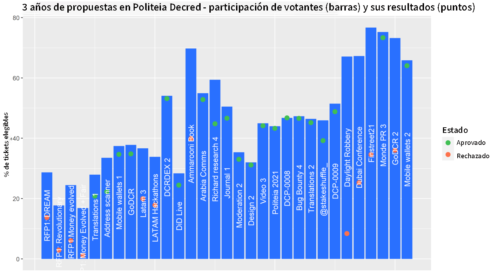

# Politeia Digest #48 — Octubre 4 — Noviembre 1 2021

Saldo de la tesorería: 733,772 DCR (aproximadamente +10,118 DCR / mes) --- $$82.5 millones (+ $1.1M/ mes) basado en el precio de $112.42 DCR.

Nuevas Propuestas
=================

[Educación y Alcance de la economía de Decred](https://proposals.decred.org/record/c1f5b5c)

Publicado el 25 de octubre por ammarooni | editado el 1 de noviembre | 17 comentarios

Esta propuesta solicita $12,000 por alrededor de 6 meses de trabajo en la producción de artículos de investigación, publicaciones en redes sociales, memes y reuniones. Es una versión revisada de una [propuesta anterior](https://proposals-archive.decred.org/proposals/9e1d644) que tenía el mismo tipo de contenido pero como parte de un libro; esta propuesta fue rechazada por un estrecho margen de un 57% de votos a favor. El alcance propuesto se centraría en DCR como un activo monetario sólido y Decred como un DAO líder. Los entregables primarios serían de 5 a 6 artículos, los entregables secundarios serían memes y difusión en las redes sociales para respaldar los entregables primarios, haciéndolo también a través de [@DecredCanada](http://twitter.com/DecredCanada) para promover un par de reuniones en el área de Toronto. El desglose de gastos propuesto es de $10,000 en trabajos de investigación y $ 2,000 en memes y reuniones.

Casi todos los comentarios son muy positivos y apoyan la propuesta. Los únicos comentarios negativos provienen de [@decredinator](http://twitter.com/decredinator), pero este se remonta a propuestas fallidas anteriores como lo fue "Bitcoin Evolution" y [documentales fiscales](https://proposals.decred.org/record/ae609f1) pero aún así está considerando votar a favor, "mejor que nada, supongo".

Propuestas Aprobadas
====================

[Billeteras móviles (2021--2022)](https://proposals.decred.org/record/6db3c4e)

Publicado el 22 de septiembre por raedah | editado el 7 de octubre | 6 comentarios (+1)

Cifras finales de votación: 26,212 votos Sí, 745 votos No (97,2% Sí) --- participación de votantes del 66%.

*Resumen: esta propuesta solicitó $72,000 para el trabajo continuo en el desarrollo de billeteras móviles para iOS y Android, desde mayo del 2021 hasta abril del 2022. Los principales logros desde que se aprobó la última *[*propuesta*](https://proposals-archive.decred.org/proposals/bc499c9)* se reflejan en la versión v1.6, que incluye privacidad de StakeShuffle, visualización de las propuestas en Politeia y notificaciones y un modo oscuro para la interfaz de usuario. Los enlaces, registros de cambios y gráficos de contribución en GitHub se proporcionan a través de un informe de progreso.*

La propuesta se editó para agregar una descripción más detallada del trabajo realizado, como las principales solicitudes de extracción, antes de que se autorizara la votación.

Propuestas Rechazadas
=====================

[GoDCR (2021--2022)](https://proposals.decred.org/record/f7d9fc8)

Publicado el 22 de septiembre por raedah | editado el 7 de octubre | 31 comentarios (+8)

Cifras finales de votación: 14,741 votos Sí, 15,234 votos No (49,2% Sí) --- participación de votantes del 73%.

*Resumen: Esta propuesta solicitó un presupuesto de $200,000 para un año de desarrollo continuo de GoDCR que cubría desde mayo del 2021 hasta abril del 2022. Esto representa un aumento significativo en el costo mensual ($ 7,500 / mes a $ 16,600 / mes) y la duración de la *[*propuesta inicial*](https://proposals-archive.decred.org/proposals/e5c8051)*. El patrocinio de Gio UI está programado para continuar a una tasa de $1,000 / mes, se informa que ha acelerado la corrección de errores y ha respaldado el proyecto upstream en el que se basa GoDCR. El progreso en GoDCR ha dado como resultado una *[*versión*](https://github.com/planetdecred/godcr/releases)* preliminar de la red de prueba que se puede probar.*

La propuesta se editó para agregar una descripción más detallada del trabajo realizado, como las principales solicitudes de extracción, antes de que se autorizara la votación.

Otras noticias
--------------

Politeia cumplió su tercer aniversario de su lanzamiento el 16 de octubre y esta publicación de [@richardred](http://twitter.com/richardred) tiene algunas estadísticas y gráficos sobre su último año y los primeros tres años en general.

Sobre esta edición
==================

Los datos de está edición están basados en este [commit](https://blockcommons.red/politeia-digest/issue047/%7Blink%7D).

El contenido de esta edición es por la autoría de @richardred con correcciones de @bee y @degeri.

Crédito de la imagen: 

[30000fps](https://medium.com/u/4ddb49ebcb04?source=post_page-----e361f1c55e70-----------------------------------)
